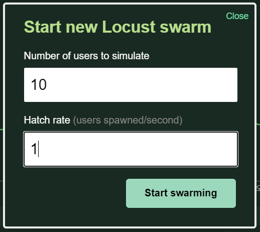
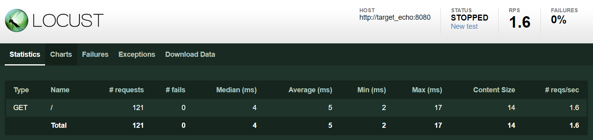
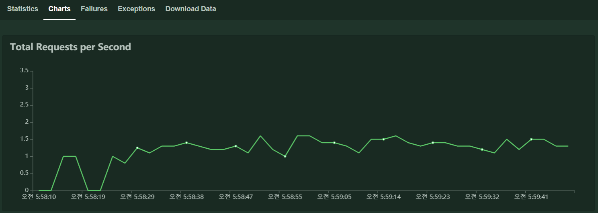

# CH10. 다양한 도커 활용 방법

- 팀 개발에서 개발환경을 통일
- 명령행 도구를 통한 도커 컨테이너 사용법
- 도커를 이용한 부하 테스트 방법

## 1. 팀 개발에서 개발 환경 통일하기

- INTRO
    - 어플리케이션 및 미들웨어의 동작을 환경 변수로 제어하는 방법으로 도커 이미지의 추상 수준을 높일 수 있다.
    - 다양한 환경에 배포하기 쉽게 할 수 있다.
    - 개발 환경을 공유하고 통일하는 방법으로 이용할 수 있다.
- 소프트웨어 및 도구 통일
    - 호스에서 격리된 환경에 필요한 도구를 갖춘 도커 컨테이너를 공통 개발 환경으로 사용하는 것이 바람직하다.
    - 예시
        - MySQL이나 Redis 같은 데이터스토어를 사용한는 프로젝트는 이 외 데이터스토어를 조작하기 위한 클라이언트 도구가 필요하다.
        - 고성능 MySQL 클라이언트인 mycli 혹은 Redis 클라이언트인 redis-tools를 팀의 표준 도구로 지정하면 다음과 같은 도커 이미지를 공통 개발 환경으로 사용할 수 있다.
        - Dockerfile
            ```Dockerfile
            FROM ubuntu:16.04

            RUN apt -y update
            RUN apt -y install net-tools \
            iproute2 \
            inetutils-ping \
            tcpdump \
            mycli \
            redis-tools
            ```
        - 이미지 빌드 및 컨테이너 생성(docker)
            ```
            $ docker image build -t ch10/workspace:latest .
            $ docker container run --rm -it --name workspace ch10/workspace:latest bash
            ```
        - 쿠버네티스에서 workspace 생성
            ```
            $ kubectl run -i --rm --tty workspace --image=ch10/workspace:latest --restart=Never -- bash -il
            ```
    - '하나의 컨테이너에 하나의 관심사'라는 도커의 원칙에는 어긋나지만, 어플리케이션 배포 용도가 아니므로 괜찮다.
- 개발 환경은 집단지성의 결과
    - 팀 내 표준 개발 환경을 도커 컨테이너 형태로 제공하는 것은 매우 의미 있는 일이다.
    - 장점
        - 일단 개발 환경을 공유하면 여러 개발자가 수고를 덜 수 있다.
        - 각자가 가진 노하우를 공유하고 이렇게 형성한 집단지성을 업무에 활용이 가능하다.
        - 환경 구성 절차를 Dockerfile 형태의 프로그램으로 작성할 수 있다.
        - 신속하게 컨테이너를 실행하고 폐기할 수 있기 때문에 개발 환경에 베스트 프랙티스를 지속해서 반영할 수 있다.

## 2. 도커 컨테이너에서 명령행 도구(CLI) 사용하기

- Dockerfile의 문법 검사를 도와주는 명령행 도구인 hadolint를 도커 컨테이너 형태로 실행한다.
    - Dockerfile
        ```
        FROM alpine

        RUN echo "docker!!"
        ```
    - 검사
        ```
        $ docker container run --rm -i hadolint/hadolint < Dockerfile
        /dev/stdin:1 DL3006 Always tag the version of an image explicitly
        ```
    - 이미지 버전 생략의 경고인 DL3006이 발생했다.
    - hadolint와 같은 도구를 처음 사용하더라도 추가적인 수고는 들지 않는다.
    - -i 옵션 : Dockerfile을 리다이렉트로 전달하기 위해서 사용하였다.
    - -v 옵션이 자주 같이 사용된다.
    - 명령행 도구도 호스트에 설치하지 않고 도커 컨테이너 형태로 사용할 수 있다.
- 이미지에서 명령행 도구 버전 변경하기
    - 명령행 도구를 사용할 때 중요함 점이 도구의 버전을 관리하는 것이다.
    - 명령행 도구를 편리하게 사용하려면도구 버전을 업데이트하거나 특정 버전으로 고정하는 작업이 꼭 필요하다.
    - 명령행 도구를 사용하면서 다음과 같은 필요가 발생할 수 있다.
        - 항상 최신 버전(보안 패치가 모두 적용된)을 사용할 수 있다.
        - 버전이 바뀔 때마다 변경 사항이 많은 도구라서 특정 버전을 고정적으로 사용하고 싶다.
    - 명령해 도구의 도커 이미지를 버전 별로 만들어 두는 것이 좋다.
        - 언제든지 필요한 버전의 명령행 도구를 사용할 수 있다.
    - 예제 : jq를 도커 컨테이너로 실행
        - Dockerfile
            ```Dockerfile
            FROM alpine:3.7

            RUN apk add --no-cache --virtual=build-devs wget && \
            wget https://github.com/stedolan/jq/releases/download/jq-1.5/jq-linux64 && \
            mv jq-linux64 /usr/local/bin/jq && \
            chmod +x /usr/local/bin/jq && \
            apk del build-devs

            ENTRYPOINT ["/usr/local/bin/jq", "-C"]
            CMD [""]
            ```
        - 이미지 빌드 및 태그 변경
            ```
            $ docker image build -t ch10/jq:latest .
            $ docker image tag ch10/jq:latest ch10/jq:1.5
            ```
        - 테스트
            ```
            $ echo '{"version":100}' | jq '.version
            $ echo '{"version":100}' | docker container run -i --rm ch10/jq:1.5 '.version
            ```
        - alias로 `docker container run -i --rm ch10/jq:1.5`를 `jq1.5`로 등록하여 사용할 수 있다.
            ```
            $ alias jq1.5='docker container run -i --rm ch10/jq:1.5'
            $ echo '{"version":100}' | jq1.5 '.version'
            ```
- 도커 컨테이너로 셸 스크립트 실행하기
    - 배포 및 운영과 관련된 내용을 포함하는 셸 스크립트를 다양한 도구를 이용해 실행하는 경우도 많다.
    - 여러 도구를 한꺼번에 다루거나 처리 과정을 코드로 옮겨 작업할 수 있다면 작업 효율이 향상시킬 수 있을 것이다.
    - 스크립트가 자신이 의존하는 도구나 라이브러리의 버전을 업데이트하면서 또 다른 도구의 동작이 달라지는 경우도 있다.
    - 셸 스크립트가 가볍고 편리하기는 하나 모든 환경에서 같은 동작을 보장하려면 여러모로 신경 써야 한다.
    - 환경 차이에서 오는 불필요한 트러블을 방지하려면 스크립트와 스크립트가 의존하는 도구를 함께 도커 컨테이너에 격리해 놓으면 된다.
    - 예제 : 표준 출력으로 출력된 JSON 문서에서 지정한 속성의 속성값을 추출한다.
        - show-attr.sh 작성(따로 실행 권한(+x)을 주지 않아도 된다.)
            ```sh
            #!/bin/bash
            ATTR=$1
            if [ "$ATTR" = "" ]; then
                echo "required attribute name argument" 1>&2
                exit 1
            fi

            echo '{
                "id": 100,
                "username": "gihyo",
                "comment": "I like Alpine Linux"
            }' | jq -r ".$ATTR"
            ```
        - Dockerfile 작성
            ```Dockerfile
            FROM alpine:3.7

            RUN apk add --no-cache --virtual=build-devs wget && \
            wget https://github.com/stedolan/jq/releases/download/jq-1.5/jq-linux64 && \
            mv jq-linux64 /usr/local/bin/jq && \
            chmod +x /usr/local/bin/jq && \
            apk del build-devs

            COPY show-attr.sh /usr/local/bin/

            ENTRYPOINT ["sh", "/usr/local/bin/show-attr.sh"]
            CMD [""]
            ```
        - 빌드 및 실행
            ```
            $ docker image build -t ch10/show-attr:latest .
            $ docker container run --rm ch10/show-attr:latest username
            ```
- 마무리
    - 컨테이너 이전의 셸 스크립트는 스크립트가 의존하는 도구나 라이브러리의 관리 문제와 스크립트만 봐서는 환경 구축 시에 알아야 할 내용을 파악하기 어렵다.
    - 컨테이너를 이용해 스크립트와 그 실행 환경 자체를 분리하면 이식성 확보는 문론이고 Dockerfile 안에 스크립트가 의존하는 도구 및 라이브러리가 한눈에 정리된다.
    - CI/CD 단계에서 스크립트를 포함하는 컨테이너 자체를 테스트할 수도 있다.

## 3. 부하 테스트

- 테스트 환경 구축
    - 로커스트
        - 부하 테스트 도구의 한 종류.
        - 여러 개의 호스트를 이용한 분산 실행을 지원한다.
        - 파이썬으로 구현되어 시나리오도 파이썬으로 작성할 수 있다.
        - 자유도와 기민성이 뛰어나다.
    - 시나리오 작성 : scenerio.py
        ```python
        from locust import HttpLocust, TaskSet, task

        class UserBehavior(TaskSet):
            @task(1)
            def index(self):
                self.client.get("/")

        class WebsiteUser(HttpLocust):
            task_set = UserBehavior
            min_wait = 5000
            max_wait = 10000
        ```
    - 로커스트 실행을 위한 Dockerfile
        ```Dockerfile
        FROM python:3.6.3-alpine3.6

        RUN apk add --no-cache --virtual=build-devs build-base && \
        apk add --no-cache gcc g++ && \
        pip install --upgrade pip && \
        apk add --no-cache python3-dev python-dev && \
        apk add --no-cache zeromq-dev
        RUN pip3 install  \
        certifi==2017.7.27.1  \
        chardet==3.0.4  \
        click==6.7  \
        Flask==1.0  \
        gevent==1.2.2  \
        greenlet==0.4.12  \
        idna==2.6  \
        itsdangerous==0.24  \
        Jinja2==2.10.1  \
        locustio==0.8.1  \
        MarkupSafe==1.0  \
        msgpack-python==0.4.8 \
        python-dotenv==0.7.1 \
        pyzmq==16.0.3 \
        requests==2.20.0 \
        six==1.11.0 \
        urllib3==1.24.2 \
        Werkzeug==0.15.3 && \
        apk del --no-cache build-devs

        WORKDIR /locust
        COPY scenerio.py /locust/

        ENTRYPOINT ["/usr/local/bin/locust"]

        EXPOSE 8089 5557 5558
        ```
    - 이미지 빌드
        ```
        $ docker image build -t ch10/locust:latest .
        ```
    - 3장의 도커 스웜 환경 구축(visualizer 포함)
        - visualizer를 위한 9000번 포트가 manager 컨테이너의 9000번 포트와 연결되어 있다.
        - locust를 위한 8000번 포트가 manager 컨테이너의 80번 포트와 연결되어 있다.
    - 테스트 전용 네트워크 loadtest 생성
        ```
        $ docker container exec -it manager docker network create --driver=overlay --attachable loadtest
        ```
    - 테스트 대상 준비
        - ch10-target.yml
            ```yml
            version: "3"
            services:
                echo:
                    image: registry:5000/gihyodocker/echo:latest
                    deploy:
                        replicas: 3
                        placement:
                            constraints: [node.role != manager]
                    networks:
                        -   loadtest
            networks:
                loadtest:
                    external: true
            ```
        - 도커 스웜에 배포
            ```
            $ docker container exec -it manager docker stack deploy -c /stack/ch10-target.yml target
            ```
    - 스웜에서 로커스트 이미지를 사용할 수 있도록 태그를 부여하여 레지스트리에 등록한다.
        ```
        $ docker image tag ch10/locust:latest localhost:5000/ch10/locust:latest
        $ docker image push localhost:5000/ch10/locust:latest
        ```
    - 스웜에 로커스트 배포
        - ch10-locust.yaml
            ```yml
            version: "3"
            services:
                locust:
                    image: registry:5000/ch10/locust:latest
                    ports:
                        -   "80:8089"
                    command:
                        -   "-f"
                        -   "scenerio.py"
                        -   "-H"
                        -   "http://target_echo:8080"
                    deploy:
                        mode: global
                        placement:
                            constraints: [node.role == manager]
                    networks:
                        -   loadtest
            networks:
                loadtest:
                    external: true
            ```
        - 도커 스웜에 배포
            ```
            $ docker container exec -it manager docker stack deploy -c /stack/ch10-locust.yml locust
            ```
    - 배포 확인
        ```
        $ curl http://localhost:8000
        ```
    - 접속 후 테스트
        - Number of users to simulate : 테스트에 사용할 가상 클라이언트 수
        - Hatch rate : 가상 클라이언트의 테스트 투입 속도
        - 각각 10, 1로 설정하여 부하테스트를 실시한다.

        

        

        
- 마스터-슬레이브 구성으로 부하 테스트하기