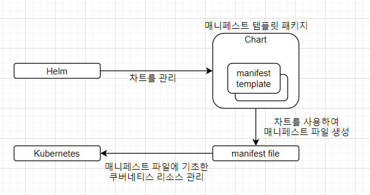
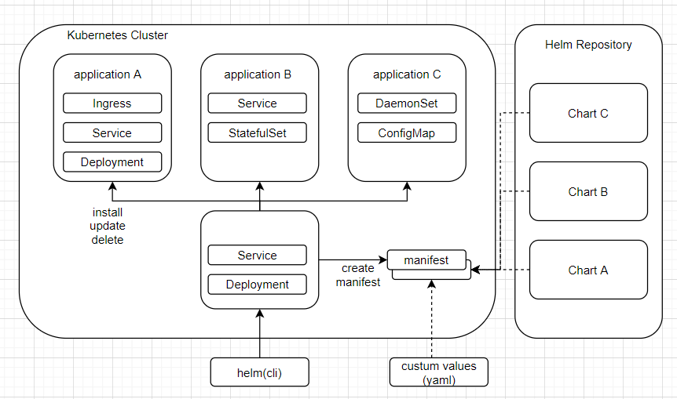
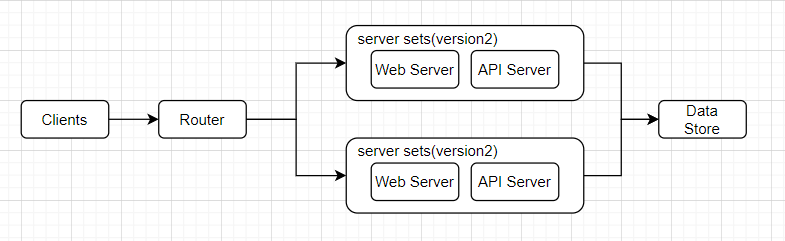

# CH07. 쿠버네티스 실전편

## 1. 쿠버네티스의 그 외 리소스

- INTRO
    - 쿠버네티스는 데몬으로 동작하는 서버 어플리케이션 외에도 배치 서버 등 다양한 형태의 어플리케이션을 구축할 수 있다.

- 잡(Job)
    - 정의 : 하나 이상의 파드를 생성해 지정된 수의 파드가 정상 종료될 때까지 이를 관리하는 리소스
    - 잡이 생성한 파드는 정상 종료된 후에도 삭제되지 않고 그대로 남아 있기 때문에 작어비 종료된 후에 파드의 로그나 실행 결과를 분석할 수 있다.
    - 데몬형 어플리케이션보다는 배치 작업 위주의 어플리케이션에 적합하다.
    - 잡은 파드 여러 개를 병렬로 실행하는 방법으로 쉽게 스케일아웃이 가능하다.
    - 파드 형태로 실행되므로 쿠버네티스 서비스와 연동하기도 쉽다.
    - simple-job.yaml
        ```yml
        apiVersion: batch/v1
        kind: Job
        metadata:
            name: pingpong
            labels:
                app: pingpong
        spec:
            parallelism: 3
            template:
                metadata:
                    labels:
                        app: pingpong
                spec:
                    containers:
                        -   name: pingpong
                            image: gihyodocker/apline:bash
                            command: ["/bin/sh"]
                            args:
                                -   "-c"
                                -   |
                                    echo [`date`] ping!
                                    sleep 10
                                    echo [`date`] pong!
                    restartPolicy: Never
        ```
        - 알파인 리눅스에 bash를 설치한 이미지를 컨테이너로 실행한다.
        - ping!을 출려하고 10초 뒤에 pong!을 출력한 뒤 종료된다.
        - spec.parallelism은 동시에 실행하는 파드의 수를 지정하는 속성이다.
            - 파드를 병렬로 실행해야할 때 편리하다.
        - restartPolicy는 파드 종료 후 재실행 여부를 설정하는 속성이다.
            - Never 혹은 OnFailure로 설정해야한다.
    - 적용 및 확인
        ```
        $ kubectl apply -f simple-job.yaml
        $ kubectl get pod -l app=pingpong --show-all
        ```
- 크론잡(cronjob)
    - 정의 : 스케줄을 지정해 정기적으로 파드를 실행할 수 있다.
    - 컨테이너 친화적인 특성을 유지하면서 스케줄에 따른 작업을 수행할 수 있다.
    - 일반적인 크론 작업은 서버의 CronTab으로 관리되지만, 크론잡 리소스는 매니페스트 파일로 정의된다.
    - 스케줄 정의 등을 깃허브의 풀 리퀘스트를 통해 검토할 수 있기 때문에 구성을 코드로 관리할 수 있다는 점에서도 유리하다.
    - simple-cronjob.yaml
        ```yml
        apiVersion: batch/v1
        kind: CronJob
        metadata:
            name: pingpong
        spec:
            schedule: "*/1 * * * *"
            jobTemplate:
                metadata:
                    labels:
                        app: pingpong
                spec:
                    containers:
                        -   name: pingpong
                            image: gihyodocker/apline:bash
                            command: ["/bin/sh"]
                            args:
                                -   "-c"
                                -   |
                                    echo [`date`] ping!
                                    sleep 10
                                    echo [`date`] pong!
                    restartPolicy: OnFailure
        ```
        - spec.schedule 속성에 Cron과 같은 포맷으로 파드를 실행할 스케줄을 정의한다.
        - spec.jobTemplate 아래에 잡 리소스와 마찬가지로 파드 정의가 들어간다.
    - 적용 및 확인
        ```
        $ kubectl apply -f simple-cronjob.yaml
        $ kubectl get job -l app=pingpong
        $ kubectl logs -l app=pingpong
        ```
    - 기존에는 작업을 정기적으로 실행하려면 작업을 실행하는 스크립트를 작성하고 리눅스 crontab으로 스케줄을 맞춰 이 스크립트를 실행하는 것이 대부분이었다.
    - 이 크론잡 리소스를 이용하면 이 모든 것을 컨테이너로 해결할 수 있다.
- 시크릿
    - 기밀정보를 평문으로 다루는 것은 어플리케이션 개발에서 금기이다.
    - 시크릿 리소스를 사용하면 이런 기밀정보 문자열을 Base64 인코딩으로 만들 수 있다.
    - 예시 : Nginx의 기본 인증정보가 적힌 파일을 시크릿으로 관리
        - openssl을 사용하여 사용자명과 패스워드를 암호화한 다음, 그 결과를 Base64 문자열로 변환한다.
            ```
            $ echo "your_username:$(openssl passwd -quiet -crypt your_password)" | base64
            ```
        - nginx-secret.yaml 파일에 시크릿 리소스의 매니페스트 파일을 작성한다.
            - 인증정보 파일인 .htpasswd 파일을 생성하고 이 파일에 base64로 면환된 문자열을 저장한다.
                ```yml
                apiVersion: v1
                kind: Secret
                metadata:
                name: nginx-secret
                type: Opaque
                data:
                    .htpasswd: [생성된 base64 문자열]
                ```
            - 적용
                ```
                $ kubectl apply -f nginx-secret.yaml
                ```
                - base64로 인코딩된 파일의 내용을 대시보드에서 확인할 수 있다.
            - 시크릿 리소스를 활용해 기본 인증이 적용된 Nginx를 구축한다. basic-auth.yaml
                ```yml
                apiVersion: v1
                kind: Service
                metadata:
                    name: basic-auth
                spec:
                    type: NodePort
                    selector:
                        app: basic-auth
                    prots:
                        -   protocol: TCP
                            port: 80
                            targetPort: http
                            nodePort: 30060
                ---
                apiVersion: apps/v1
                kind: Deployment
                metadata:
                    name: basic-auth
                    labels:
                        app: basic-auth
                spec:
                    replicas: 1
                    selector:
                        matchLabels:
                            app: basic-auth
                    template:
                        metadata:
                            labels:
                                app: basic-auth
                        spec:
                            containers:
                                -   name: nginx
                                    image: "gihyodocker/nginx:latest"
                                    imagePullPolicy: Always
                                    ports:
                                        -   name: http
                                            containerPort: 80
                                    env:
                                        -   name: BACKEND_HOST
                                            value: "localhost:8080"
                                        -   name: BASIC_AUTH_FILE
                                            value: "/etc/nginx/secret/.htpasswd"
                                    volumeMounts:
                                        -   mountPath: /etc/nginx/secret
                                            name: nginx-secret
                                            readOnly: true
                                -   name: echo
                                    image: "gihyodocker/echo:latest"
                                    imagePUllPolicy: Always
                                    ports:
                                        -   containerPort: 8080
                                    env:
                                        -   name: HTTP_PORT
                                            value: "8080"
                            volumes:
                                -   name: nginx-secret
                                    secret:
                                        secretName: nginx-secret
                ```
                - 앞에서 생성한 nginx-secret 스크릿을 볼륨으로 마운트할 준비를 한다.
                - nginx 컨테이너 안의 /etc/nginx/secret 디렉터리에 마운트한다.
                - nginx-secret에 .htpasswd로 설정된 Base64 문자열이 디코딩되어 nginx 컨테이너의 /etc/nginx/secret/.htaccess 파일이 된다.
                - gihyodocker/nginx:latest 이미지에 환경 변수 BASIC_AUTH_FILE에 인증정보 파일의 경로를 설정해 기본 인증을 적용한다.
            - 적용
                ```
                $ kubectl apply -f basic-auth.yaml
                ```
            - 확인
                ```
                $ curl http://localhost:30060
                $ curl -i --user your_username:your_password http://localhost:30060
                ```
    - 시크릿 리소스를 사용하면 민감한 정보를 평문으로 방치하지 않을 수 있다.
    - 시크릿 리소스는 여러 층위에 걸치 보안 대책 중 하나라고 생각해야한다.
    - 리포지토리는 물론이고 쿠버네티스 대시보드 및 파드에도 제삼자가 접근하지 못하도록 하는 것이 중요하다.
- 인증정보를 환경변수로 안전하게 관리하기
    ```
    $ echo -n "gihyo:gihyo@tcp(mysql-master:3306)/tododb?parseTime=true" | base64
    $ echo -n "gihyo:gihyo@tcp(mysql-slave:3306)/tododb?parseTime=true" | base64
    ```
    - secret
        ```yml
        apiVersion: v1
        kind: Secret
        metadata:
        name: mysql-secret
        type: Opaque
        data:
            username: [master의 인코딩 결과]
            password: [slave의 인코딩 결과]
        ```
    - api 디플로이먼트 수정 : 환경변수의 value 대신에 valueFrom.SecretKeyRef를 사용한다.
        ```yml
        apiVersion: v1
        kind: Service
        metadata:
            name: todoapi
            labels:
                app: todoapi
        spec:
            selector:
                app: todoapi
            ports:
                -   name: http
                    port: 80
        ---
        apiVersion: apps/v1
        kind: Deployment
        metadata:
            name: todoapi
            labels:
                name: todoapi
        spec:
            replicas: 2
            selector:
                matchLabels:
                    app: todoapi
            template:
                metadata:
                    labels:
                        app: todoapi
                spec:
                    containers:
                        -   name: nginx
                            image: gihyodocker/nginx:latest
                            imagePullPolicy: Always
                            ports:
                                -   containerPort: 80
                            env:
                                -   name: WORKER_PROCESSES
                                    value: "2"
                                -   name: WORKER_CONNECTIONS
                                    value: "1024"
                                -   name: LOG_STDOUT
                                    value: "true"
                                -   name: BACKEND_HOST
                                    value: "localhost:8080"
                        -   name: api
                            image: gihyodocker/todoapi:latest
                            imagePullPolicy: Always
                            ports:
                                -   containerPort: 8080
                            env:
                                -   name: TODO_BIND
                                    value: ":8080"
                                -   name: TODO_MASTER_URL   # (1) 수정
                                    valueFrom:
                                        secretKeyRef:
                                            name: mysql-secret
                                            key: username
                                -   name: TODO_SLAVE_URL    # (2) 수정
                                        secretKeyRef:
                                            name: mysql-secret
                                            key: password
        ```
    - 확인
        ```
        $ kubectl describe pod todoapi-[무작위로 생성]
        ```

## 2. 사용자 관리와 RBAC

- INTRO
    - 기본적인 보안 방법 : 사용자마다 권한을 제한하는 정책

    |명칭|내용|
    |:---|:---|
    |일반 사용자|클러스터 외부에서 쿠버네티스를 조작하는 사용자로, 다양한 방법으로 인증을 거친다.|
    |서비스 계정|쿠버네티스 내부적으로 관리되며 파드가 쿠버네티스 API를 다룰 때 사용하는 사용자.|

    - 일반 사용자
        - 개발자 및 운영 실무자가 쿠버네티스를 조작하기 위해 사용한다.
        - 쿠버네티스 클러스 외부로부터 들어오는 접근을 관리하기 위한 사용자.
    - 서비스 계정
        - 쿠버네티스 리소스의 일종
        - 클러스터 내부에서 권한을 관리하는 역할을 한다.
        - 서비스 계정과 연결된 파드는 주어진 권한에 따라 쿠버네티스 리소스를 다룰 수 있다.
- RBAC(Role-Based Access Control)
    - 서비스 계정과 일반 사용자의 권한을 제어하는 메커니즘
    - RBAC는 롤에 따라 리소스에 대한 권한을 제어하는 기능이라 개념이다.

    

    

    |리소스|내용|
    |:---|:---|
    |롤|각 쿠버네티스 API의 사용 권한을 정의한다. 지정된 네임스페이스 안에서만 유효함.|
    |롤바인딩|일반 사용자 및 그룹/서비스 계정과 롤을 연결한다.|
    |클러스터롤|각 쿠버네티스 API의 사용 권한을 정의한다. 클러스터 전체에서 유효함.|
    |클러스터롤바인딩|일반 사용자 및 그룹/서비스 계정과 클러스터롤을 연결.|
- 롤과 바인딩 리소스 생성하기
    - ClusterRole 생성
        ```
        $ cat <<EOF | kubectl apply -f -
        kind: ClusterRole
        apiVersion: rbac.authorization.k8s.io/v1
        metadata:
        name: pod-reader
        rules:
        - apiGroups: [""]
        resources: ["pods"]
        verbs: ["get", "watch", "list"]
        EOF
        ```
    - ClusterRoleBinding 생성
        ```
        $ cat <<EOF | kubectl apply -f -
        kind: ClusterRoleBinding
        apiVersion: rbac.authorization.k8s.io/v1
        metadata:
        name: pod-read-binding
        subjects:
        - kind: ServiceAccount
        name: gihyo-user
        namespace: default
        roleRef:
        kind: ClusterRole
        name: pod-reader
        apiGroup: rbac.authorization.k8s.io
        EOF
        ```
        - subject 속성 아래 롤이 연결된 일반 사용자 또는 일반 사용자 그룹을 지정한다.
- 일반 사용자 및 일반 사용자 그룹 생성
    - 일반 사용자의 인증 방법
        - 서비스 계정 토큰 방식
        - 정적 토큰 파일 방식
        - 패스워드 파일 방식
        - X509 클라이언트 인증서 방식
        - OpenID 방식
    - 서비스 계정 토큰 방식을 사용하여 인증을 진행하겠다.
    - 계정 생성
        ```
        $ kubectl create serviceaccount gihyo-user
        ```
    - 새롭게 생성한 계정의 권한 확인
        ```
        $ kubectl get serviceaccount gihyo-user -o yaml
        ```
    - 서비스 계정을 생성하면 그 인증정보가 되는 시크릿 리소스가 함께 생성된다.
        - secret 아래의 gihyo0user-token-dwwmp 부분이 이에 해당한다.
        ```
        $ kubectl get secret gihyo-user-token-dwwmp -o yaml
        ```
        - 출력되는 부분에서 인증 토큰 부분(data.token)을 복사한다.
        - 이 토큰은 Base64 인코딩 문자열로, 이를 디코딩한 문자열이 실제 인증 토큰이 된다.(토큰을 잘 보관해 둔다.)
            ```
            $ echo '[보관한 토큰]' | base64 -D
            [결과를 보관한다.]
            ```
- 생성한 일반 사용자 사용하기
    - kubectl은 HTTP/HTTPS로 쿠버네티스 API를 호출하여 쿠버네티스 클러스터의 마스터 노드에 접근한다.
    - 이때 필요한 인증정보는 마스터 노드의 ~/.kube/config라는 yaml 파일에 설정되어 있다.
        ```
        $ kubectl config view
        ```
        - current-context : 현재 컨텍스트를 의미한다.
            - context : 쿠버네티스 클러스터 API를 사용하는 주체가 되는 일반 사용자를 결정하는 정보
        - docker-for-desktop의 context.user의 값이 docker-for-desktop이므로 docker-for-desktop이라는 인증 사용자가 클러스터를 조작하는 주체임을 알 수 있다.
    - 일반 사용자 사용하기
        - gihyo-user의 인증 토큰을 사용한다.
            ```
            $ kubectl config set-credentials gihyo-user --token=[토큰 값]
            ```
        - 컨텍스트 설정
            ```
            $ kubectl config set-context gihyo-k8s-gihyo-user --cluster=gihyo-k8s --user=gihyo-user
            ```
        - 컨텍스트 전환
            ```
            $ kubectl config use-context gihyo-k8s-gihyo-user
            ```
        - 확인
            ```
            $ kubectl get pod --all-namespaces
            $ kubectl get deployment --all-namespaces
            ```
            - pod은 get이 되지만 depolyment는 권한이 없기 때문에 참조할 수 없다.
        - 되돌아가기
            ```
            $ kubectl config use-context docker-for-desktop
            ```
    - 사용자 및 사용자 그룹을 생성하고, 이들에게 클러스터에 대한 접근 권한을 적절히 부여해야 보안성을 확보할 수 있다.
    - 팀 개발 환경의 권한 관리의 예시
        - admin, deployer, viewer로 그룹을 생성한 다음, 일반 사용자를 적절한 그룹으로 나눠 서비스 및 인그레스의 변경 권한을 일반 사용자에게 부여.
        - 대규모 구성 변경이 따르는 작업은 더 높은 권한을 갖는 전용 일반 사용자로 전환해 수행하며, 일반 사용자는 극히 제한된 인원만 사용하도록 한다.
- 서비스 계정
    - 일반 사용자/그룹에 대한 RBAC는 일반적으로 쿠버네티스 클러스터 외부에서 조작하는 경우가 대부분이다.
    - 서비스 계정은 클러스터 안에서 실행중인 파드에서 역시 클러스터 안에 있는 리소스에 접근하기 위해 사용되는 리소스다.
    - 서비스 계정 gihyo-pod-reader 생성
        ```
        $ cat <<EOF | kubectl apply -f -
        apiVersion: v1
        kind: ServiceAccount
        metadata:
        name: gihyo-pod-reader
        namespace: kube-system
        EOF
        ```
    - ClusterRoleBinding 생성
        ```
        $ cat <<EOF | kubectl apply -f -
        apiVersion: v1
        kind: ClusterRoleBinding
        metadata:
        name: pod-reader-binding
        subjects:
        - kind: ServiceAccount
        name: gihyo-pod-reader
        namespace: kube-system
        roleRef:
        kind: ClusterRole
        name: pod-reader
        apiGroup: rbac.authorization.k8s.io
        EOF
        ```
- 서비스 계정과 파드 연결하기
    - kubectl을 사용해서 모든 네임스페이스의 파드 목록을 받아온다.
        - simple-serviceaccount.yaml
            ```yml
            apiVersion: v1
            kind: Pod
            metadata:
                name: gihyo-pod-reader
                namespace: kube-system
                labels:
                    app: gihyo-pod-reader
            spec:
                serviceAccountName: gihyo-pod-reader
                containers:
                    -   name: kubectl
                        image: lachanevenson/k8s-kubectl:v1.10.4
                        command:
                            -   sh
                            -   -c
                            -   |
                                while true
                                do
                                    echo "check pod..."
                                    kubectl get pod --all-namespaces
                                    sleep 30
                                done
            ```
        - 적용 및 확인
            ```
            $ kubectl apply -f simple-serviceaccount.yaml
            $ kubectl -n kube-system logs -f gihyo-pod-reader
            ```
        - serviceAccountName 값에 서비스 계정 이름을 지정하여 이 파드로 권한이 주어진 쿠버네티스 API를 사용할 수 있다.
    - 서비스 계정 gihyo-pod-reader는 파드 정보를 열람할 수 있는 권한만 주어져 있다.
    - 디플로이먼트를 받아오도록 파드를 생성한다면 접근 권한이 없음을 확인할 수 있다.
        ```yml
            apiVersion: v1
            kind: Pod
            metadata:
                name: gihyo-pod-reader
                namespace: kube-system
                labels:
                    app: gihyo-pod-reader
            spec:
                serviceAccountName: gihyo-pod-reader
                containers:
                    -   name: kubectl
                        image: lachanevenson/k8s-kubectl:v1.10.4
                        command:
                            -   sh
                            -   -c
                            -   |
                                while true
                                do
                                    echo "check deployment..."
                                    kubectl get deployment --all-namespaces
                                    sleep 30
                                done
        ```
    - 서비스 계정을 사용하면 파드가 쿠버네티스 API에 안전하게 접근할 수 있다.
    - 특히 이러한 기능은 파드 안에서 수정이나 삭제 같은 작업을 수행하는 어플리케이션에서 유용하다.
    - serviceAccountName 속성은 파드의 정의에 포함되므로 레플리카세트나 디플로이먼트, 스테이트풀세트, 잡 같은 리소스가 생성하는 파드에도 부여할 수 있다.
    - 서비스 계정을 이용하면 쿠버네티스 리소스를 확보하고 조작하는 어플리케이션을 구축할 수 있다.

## 3. 헬름

- INTRO
    - 쿠버네티스를 운영할 때 단일 클러스터로만 운영하는 경우는 흔하지 않다.
    - 같은 어플리케이션을 여러 클러스터에 배포해야 하는 경우가 있다.
    - 배포 대상 환경에 따라 API나 데이터베이스 주소가 달라질 것이다.
    - 이를 파드에 환경 변수를 통해 설정하려면 배포 대상 환경에 따라 환경 변수 값이 달라지도록 디플로이먼트의 매니페스트 파일을 작성해야 한다.
    - 서비스 같은 리소스는 환경에 상관없이 공통으로 사용하는 경우가 많지만, 인그레스로 설정하는 도메인은 거의 무조건 배포 환경에 따라 달라진다.
    - 헬름(배포 메커니즘)
        - 쿠버네티스 차트를 관리하기 위한 도구
        - 차트는 사전 구성된 쿠버네티스 리소스의 패키지이다.
        - Helm is a tool for managing Kubernetes charts. Charts are packages of pre-configured Kubernetes resources.

        

        - 헬름으로 차트를 관리하는 목적
            - 번잡해지기 쉬운 매니페스트 파일을 관리하기 쉽게 하기 위한 것이다.
            - 여러 클러스터를 대상으로 하는 배포 역시 쉽고 간결하게 관리할 수 있다.
        - 헬름은 패키지 관리자인 동시에 차트를 중심으로 하는 쿠버네티스 개발 업무의 종합 관리 도구라고 볼 수 있다.
    - 실무에선 어플리케이션은 모두 차트로 패키징하여 kubectl 대신 헬름으로 배포 및 업데이트를 수행한다.
    - kubectl은 이미 배포된 리소스를 운영 중에 수정할 때 사용한다.
- 헬름 설치
    - [여기](https://github.com/helm/helm/release)에서 최신버전을 설치한다.
    - 바이너리를 PATH가 설정된 디렉토리로 옮긴다.
    - 초기화 작업을 실시한다.
    - tiller 서비스 account 생성 및 admin 권한 부여
    ```
    $ wget https://get.helm.sh/helm-v2.16.9-linux-amd64.tar.gz
    $ tar zxvf helm-v2.16.9-linux-amd64.tar.gz
    $ cd linux-amd64
    $ chmod +x helm tiller
    $ mv ./helm /usr/local/bin/helm
    $ mv ./tiller /usr/local/bin/tiller
    $ kubectl -n kube-system create sa tiller
    $ kubectl create clusterrolebinding tiller --clusterrole cluster-admin --serviceaccount=kube-system:tiller
    $ helm init
    ```
    - 확인
        ```
        $ kubectl -n kube-system get service,deployment,pod --selector app=helm
        $ helm version
            [클라이언트(cli)와 서버(Tiller)의 버전이 각각 출력된다.]
        $ helm init --upgrade
            [안정적인 버전으로 업그레이드]
        ```
- 헬름의 주요 개념
    
    

    - 헬름은 클라이언트(cli)와 서비(쿠버네티스 클러스터에 설치되는 틸러)로 구성된다.
    - 클라이언트는 서버를 대상으로 명령을 지시하는 역할을 한다.
    - 서버는 클라이언트에서 전달받은 명령에 따라 쿠버네티스 클러스터에 패키지 설치, 업데이트 삭제 등의 작업을 수행한다.
    - 쿠버네티스는 서비스나 디플로이먼트, 인그레스 같은 리소스를 생성하고 매니레스트 파일을 적용하는 방식으로 어플리케이션을 배포한다.
    - 매니페스트 파일을 생성하는 템플릿을 여러 개 패키징한 것이 차트다.
    - 차트는 헬름 리포지토리에 tgz 파일로 저장되며, 틸러가 매니페스트를 생성할 때 사용한다.

    - 리포지토리

        |종류|내용|
        |:---|:---|
        |local|헬름 클라이언트가 설치된 로컬 리포지토리로, 로컬에서 생성한 패키지가 존재한다.|
        |stable|안정 버전에 이른 차트가 존재하는 리포지토리다. 안정된 보안 수준과 기본 설정값을 포함하는 등 일정한 요건을 만족하는 차트만 제공될 수 있다.|
        |incubator|stable 요건을 만족하지 못하는 차트가 제공되는 리포지토리다. 가까운 시일 내에 stable로 넘어갈 예정인 차트가 제공된다.|

        - stable 리포지토리는 기본값으로 사용되는 리포지토리로, 깃허브 helm/chars 리포지토리에 저장된 차트를 사용할 수 있다.
        - incubator 리포지토리는 기본값으로 사용되지는 않으나, 리포지토리를 추가할 수 있다.
            ```
            $ helm repo add incubator https://kubernetes-chars-incubator.storage.googleapis.com/
            ```
        - 리포지토리에서 차트를 검색할 수 있다.
            ```
            $ helm search
            ```
- 차트의 구성
    ```
    chartname/ -- templates/        매니페스트 파일 템플릿 디렉토리
        | |- xxxx.yaml              각종 쿠버네티스 리소스의 매니페스트 템플릿
        | |- _helper.tpl            매니페스트 렌더링에 사용되는 템플릿 헬퍼
        | |- NOTE.txt               차트 사용법 등의 참조 문서 템플릿
        |
        |- charts/                  이 차트가 의존하는 차트의 디렉토리
        |- Chart.yaml               차트 정보가 정의된 파일
        |- values.yaml              차트 기본값 value 파일
    ```
    - 차트는 어플리케이션의 동작을 제어하는 설정의 기본값을 '기본값 value 파일'에 해당하는 values.yaml 파일에 정의한다.
    - 설치할 때 이 기본값을 변경 하려면 기본값 value 파일에서 변경할 값만 수정한 '커스텀 value 파일'을 만든다.
- 차트 설치하기
    - 기본 명령
        ```
        $ helm install [--name 릴리즈_네임] 차트_리포지토리/차트명
        ```
    - redmine 사용
        - redmine.yaml 작성
            ```yml
            redmineUsername: gihyo
            redminePassword: gihyo
            redmineLanguage: ja

            serviceType: NodePort
            ```
        - 차트 설치 및 확인
            ```
            $ helm install -f redmine.yaml --name redmine stable/redmine
            $ helm ls
            $ kubectl get service,deployment --selector release=redmine
            ```
- 차트로 설치한 어플리케이션 제거
    ```
    $ helm delete redmine
    $ helm ls
    $ helm ls --all
    $ helm rollback redmine 2
    $ helm del --purge redmine
    ```
    - delete만 한다면 리비전이 남기 때문에 롤백할 수 있다.
    - --purge 옵션을 사용하여 리비전기록을 남기지 않고 삭제할 수 있다.
- RBAC를 지원하는 어플리케이션 설치하기
    - RBAC를 활성화한 어플리케이션을 설치하려면 실제 설치 작업을 수행한 틸러에 cluster-admin이라는 롤이 부여되어야 한다.
        ```
        $ kubectl create serviceaccount tiller --namespace kube-system
        $ kubectl create clusterrolebinding tiller-cluster-rule --clusterrole=cluster-admin --serviceaccount=kube-system:tiller
        $ kubectl patch deploy --namespace kubㄷ-system tiller-deploy -p '{"spec":{"template":{"spec":{"serviceAccount":"tiller"}}}}'
        ```
    - 테스트 : stable/jenkins 차트로 젠킨스 설치
        - 차트의 기본값 value 파일에는 젠킨스에서 사용할 서비스 계정과 롤, ClusterRoleBinding을 생성하기 위한 파라미터 rbac.create가 들어 있으며 기본값은 false이다.
        - jenkins.yaml
            ```
            rbac:
            create: true
            ```
        - 설치 및 확인
            ```
            $ helm install -f jenkins.yaml --name jenkins stable/jenkins
            $ kubectl describe sa,role,clusterrolebinding | grep jenkins
            ```
    - stable 리포지토리에 공개된 대부분의 차트는 rbac.create나 rbac.install 속성값을 사용해서 RBAC의 활성 여부를 설정할 수 있다.
- 사용자 차트 생성하기
    - 쿠버네티스에서 동작하는 대부분의 어플리케이션은 서비스나 인그레스, 디플로이먼트 같은 쿠버네티스 리소스로 구성된다.
    - 차트는 이 구성을 추상화하고 패키징해 배포하기 위한 것으로, 매니페스트 파일을 복사해 하나 이상의 환경에 배포하는 방식보다 유지 보수성이 좋다.
    - 3장의 nginx와 echo로 구성된 어플리케이션 차트
        - 로컬 리포지토리 활성화
            - 리포지토리 확인
                ```
                $ helm repo list
                ```
            - URL에 HTTP 프로토콜로 접근할 수 있어야 사용이 가능하다. 하지만 local 저장소는 외부에서 접근이 불가하다.
            - 서버를 백그라운드로 실행
                ```
                $ helm server &
                ```
        - 템플릿 생성
            ```
            $ helm create echo
            ./echo
            ├── charts
            ├── Chart.yaml
            ├── templates
            │   ├── deployment.yaml
            │   ├── _helpers.tpl
            │   ├── ingress.yaml
            │   ├── NOTES.txt
            │   ├── serviceaccount.yaml
            │   ├── service.yaml
            │   └── tests
            │       └── test-connection.yaml
            └── values.yaml
            ```
        - 디플로이먼트(echo/templates/deployment.yaml)
            ```yml
            apiVersion: apps/v1
            kind: Deployment
            metadata:
                name: echo
                labels:
                    app: echo
            spec:
                replicas: 1
                selector:
                    matchLabels:
                        app: echo
                template:
                    metadata:
                        labels:
                            app: echo
                    spec:
                        containers:
                            -   name: nginx
                                image: "gihyodocker/nginx:latest"
                                imagePullPolicy: Always
                                livenessProbe:
                                    httpGet:
                                        path: /
                                        port: 80
                                readinessProbe:
                                    httpGet:
                                        path: /
                                        port: 80
                                ports:
                                    -   name: http
                                        containerPort: 80
                                env:
                                    -   name: BACKEND_HOST
                                        value: "localhost:8080"
                            -   name: echo
                                image: "gihyodocker/echo:latest"
                                imagePullPolicy: Always
                                ports:
                                    -   containerPort: 8080
                                env:
                                    -   name: HTTP_PORT
                                        value: "8080"
            ```
            또는
            ```yml
            kind: Deployment
            metadata:
                name: {{ include "echo.fullname" . }}
                labels:
                    app: {{ include "echo.name" . }}
                    chart: {{ include "echo.chart" . }}
                    release: {{ .Release.Name }}
                    heritage: {{ .Release.Name }}
            spec:
                replicas: {{ .Values.replicaCount }}
                selector:
                    matchLabels:
                        app: {{ include "echo.name" . }}
                        release: {{ .Release.Name }}
                template:
                    metadata:
                        labels:
                            app: {{ include "echo.name" . }}
                            release: {{ .Release.Name }}
                    spec:
                        containers:
                            -   name: nginx
                                image: "{{ .Values.nginx.image.repository }}:{{ .Values.nginx.image.tag }}"
                                imagePullPolicy: {{ .Values.nginx.image.pullPolicy }}
                                ports:
                                    -   name: http
                                        containerPort: 80
                                livenessProbe:
                                    httpGet:
                                        path: {{ .Values.nginx.healthCheck }}
                                        port: 80
                                readinessProbe:
                                    httpGet:
                                        path: {{ .Values.nginx.healthCheck }}
                                        port: http
                                env:
                                    -   name: BACKEND_HOST
                                        value: {{ .Values.nginx.backendHost | quote }}
                            -   name: echo
                                image: "{{ .Values.echo.image.repository }}:{{ .Values.echo.image.tag }}"
                                imagePullPolicy: {{ .Values.echo.image.pullPolicy }}
                                ports:
                                    -   containerPort: {{ .Values.echo.httpPort | default "80" }}
                                env:
                                    -   name: HTTP_PORT
                                        value: {{ .Values.echo.httpPort | quote }}
                        resources:
                            {{ toYaml .Values.resources | indent 12 }}
                        {{- with .Values.nodeSelector }}
                        nodeSelector:
                            {{- toYaml . | nindent 8 }}
                        {{- end }}
                        {{- with .Values.affinity }}
                        affinity:
                            {{- toYaml . | nindent 8 }}
                        {{- end }}
                        {{- with .Values.tolerations }}
                        tolerations:
                            {{- toYaml . | nindent 8 }}
                        {{- end }}
            ```
        - echo/values.yaml 수정
            ```yml
            replicaCount: 1
            nginx:
                image:
                    repository: gihyodocker/nginx
                    tag: latest
                    pullPolicy: Always
                healthCheck: /
                backendHost: localhost:8080
            nginx:
                image:
                    repository: gihyodocker/echo
                    tag: latest
                    pullPolicy: Always
                httpPort: 8080
            ```
        - 서비스
            ```yml
            apiVersion: v1
            kind: Service
            metadata:
                name: echo
                labels:
                    app: echo
            spec:
                type: NodePort
                ports:
                    -   port: 80
                        targetPort: http
                        protocol: TCP
                        name: echo
                selector:
                    app: echo
            ```
            또는
            ```yml
            kind: Service
            metadata:
                name: {{ include "echo.fullname" . }}
                labels:
                    app: {{ include "echo.name" . }}
                    chart: {{ include "echo.chart" . }}
                    release: {{ .Release.Name }}
                    heritage: {{ .Release.Service }}
            spec:
                type: {{ .Values.service.type }}
                ports:
                    -   port: {{ .Values.service.externalPort }}
                        targetPort: http
                        protocol: TCP
                        name: {{ .Values.service.name }}
                selector:
                    app: {{ include "echo.name" . }}
                    release: {{ .Release.Name }}
            ```
        - echo/values.yaml 수정
            ```yml
            service:
                name: echo
                type: NodePort
                externalPort: 80
            ```
        - 인그레스
            ```yml
            apiVersion: extensions/v1beta1
            kind: Ingress
            metadata:
                name: echo
                labels:
                    app: echo
            spec:
                rules:
                    -   host: myhelm.chart.local
                        http:
                            paths:
                                -   backend:
                                        serviceName: echo
                                        servicePort: 80
            ```
            또는
            ```yml
            {{- if .Values.ingress.enabled -}}
            apiVersion: extensions/v1beta1
            kind: Ingress
            metadata:
            name: {{ $fullName }}
                labels:
                    app: {{ include "echo.name" . }}
                    chart: {{ include "echo.chart" . }}
                    release: {{ .Release.Name }}
                    heritage: {{ .Release.Service }}
            {{- with .Values.ingress.annotations }}
                annotations:
                {{- toYaml . | nindent 4 }}
            {{- end }}
            spec:
                {{- if .Values.ingress.tls }}
                tls:
                    {{- range .Values.ingress.tls }}
                    -   hosts:
                        {{- range .hosts }}
                            -   {{ . | quote }}
                        {{- end }}
                        secretName: {{ .secretName }}
                    {{- end }}
                {{- end }}
                rules:
                    {{- range .Values.ingress.hosts }}
                    -   host: {{ .host | quote }}
                        http:
                            paths:
                                    backend:
                                        serviceName: {{ .Values.ingress.serviceName }}
                                        servicePort: http
                    {{- end }}
                selector:
                    app: {{ .Values.ingress.app }}
            {{- end }}
            ```
        - echo/values.yaml 수정 없음
        - 차트 패키지 생성 및 value 생성
            ```
            $ helm package echo
            $ cat echo.yaml
            ingress:
                enabled: true
                hosts:
                    -   myhelm.chart.local
                app: echo
                serviceName: echo
            ```
        - 차트 설치 및 확인
            ```
            $ helm install --name echo local/echo  # (1)
            $ helm install -f echo.yaml --name echo local/echo # (2)
            $ kubectl get deployment,service,ingress --selector app=echo
            NAME                         READY   UP-TO-DATE   AVAILABLE   AGE
            deployment.extensions/echo   1/1     1            1           19m

            NAME           TYPE       CLUSTER-IP      EXTERNAL-IP   PORT(S)        AGE
            service/echo   NodePort   10.15.245.159   <none>        80:32121/TCP   19m

            NAME                      HOSTS                ADDRESS         PORTS   AGE
            ingress.extensions/echo   myhelm.chart.local   34.120.52.169   80      19m
            ```
            - (1) : ingress를 새롭게 정의한 경우
            - (2) : ingress를 자동 생성 파일을 기반으로 수정한 경우
            - 생성되는 시간까지 기다렸다가 HTTP 통신을 시도하면 아래와 같은 결과가 나온다.
            ```
            $ curl http://34.120.52.169 -H 'host: myhelm.chart.local'
            Hello Docker!!
            ```
    - 사용자 리포지토리 for 차트
        - 패키징된 차트는 로컬 리포지토리에서 불러다 사용할 수 있지만, 팀 개발 업무에서 이 차트를 사용하려면 중앙에서 관리하는 원격 리포지토리가 필요하다.
        - github 리포지토리를 charts라는 이름으로 생성한다.
        - 생성한 리포지토리를 클론받는다.
        - gh-pages 브랜치를 생성하고, 아래의 명령을 수행한다.
            ```
            (charts) $ git checkout -b gh-pages
            (charts) $ mkdir stable
            (charts) $ cd stable
            (charts/stable) $ helm create example
            (charts/stable) $ helm package example
            (charts/stable) $ helm repo index .
            (charts/stable) $ git add -A
            (charts/stable) $ git commit -m "add first Chart"
            (charts/stable) $ git push origin gh-pages
            ```
        - git-page를 활성화시키는데 source를 gh-pages로 설정한다.
        - 확인
            ```
                # 파일의 내용을 확인한다.
            $ curl -s https://[계정이름].github.io/charts/stable/index.yaml
            ```
        - 리포지토리 등록 및 확인
            ```
            $ helm repo add joon-stable http://lameld.github.io/charts/stable
            $ helm repo update
            $ helm search example
            $ helm install --namespace default --name example joon-stable/example
            ```

## 4. 쿠버네티스 배포 전략

- INTRO
    - 배포 기능 및 배포 전략을 수립하는 것은 개발자의 주요 업무.
    - 컨테이너를 사용한 배포는 각 서버가 도커 이미지를 직접 받아가는 풀 배포(pull deployment)이므로 배포 및 스케일 아웃이 쉽다.
    - 배포의 기본적인 부분은 도커와 컨테이너 오케스트레이션에 속하기 때문에 기존 방법처럼 많은 수고를 들일 필요가 없다.
    - 쿠버네티스 역시 컨테이너의 장점을 살려 배포할 수 있다.
    - 하지만 이제는 더욱더 정교한 운영을 위해 어떻게 배포 작업을 자동화하고 서비스 무중단을 유지해야 할지를 고민한다.
- 롤링 업데이트
    - 디플로이먼트 리소스에서는 파드를 교체하는 저략을 .spec.strategy.type 속성에 정의했다.
    - spec.strategy.type의 값은 RollingUpdate와 Recreate의 두 가지 값을 지정할 수 있는데, 기본값은 RollingUpdate다.
    - 롤링 업데이트의 동작
        - echo-version.yaml
            ```yml
            apiVersion: v1
            kind: Service
            metadata:
                name: echo-version
                labels:
                    app: echo-version
            spec:
                ports:
                    -   port: 80
                        targetPort: 8080
                selector:
                    app: echo-version
            ---
            apiVersion: apps/v1
            kind: Deployment
            metadata:
                name: echo-version
                labels:
                    app: echo-version
            spec:
                replicas: 1
                selector:
                    matchLabels:
                        app: echo-version
                template:
                    metadata:
                        labels:
                            app: echo-version
                    spec:
                        containers:
                            -   name: echo-version
                                image: gihyodocker/echo-version:0.1.0
                                ports:
                                    -   containerPort: 8080
            ```
        - update-checker.yaml
            ```yml
            apiVersion: v1
            kind: Pod
            metadata:
                name: update-checker
                labels:
                    app: update-checker
            spec:
                containers:
                    -   name: kubectl
                        image: gihyodocker/fundamental:0.1.0
                        command:
                            -   sh
                            -   -c
                            -   |
                                while true
                                do
                                    APP_VERSION=`curl -s http://echo-version/`
                                    echo "[`date`] $APP_VERSION "
                                    sleep 1
                                done
            ```
        - 표준 출력을 모니터링하여 업데이트를 체크한다.
            ```
            $ kubectl logs -f update-checker
            ```
        - echo-version 버전 업데이트
            ```
            $ kubectl patch deployment echo-version \
            -p '{"spec":{"template":{"spec":{"containers":[{"name":"echo-version", "image":"gihyodocker/echo-version:0.2.0"}]}}}}'
            ```
        - 확인
            - 업데이트 로그
                ```
                [Thu Jun 25 03:51:02 UTC 2020] APP_VERSION=0.1.0
                [Thu Jun 25 03:51:03 UTC 2020] APP_VERSION=0.1.0
                [Thu Jun 25 03:51:04 UTC 2020] APP_VERSION=0.2.0
                [Thu Jun 25 03:51:05 UTC 2020] APP_VERSION=0.2.0
                ```
            - 업데이트 전 파드
                ```
                NAME                           READY   STATUS    RESTARTS   AGE
                echo-version-86c89bcb5-xlwjh   1/1     Running   0          77s
                ```
            - 업데이트 중 파드
                ```
                echo-version-569d787bdb-5s5r2   0/1     ContainerCreating       0          2s
                echo-version-86c89bcb5-xlwjh    1/1     Running                 0          87s
                ```
            - 업데이트 완료 파드
                ```
                echo-version-569d787bdb-5s5r2   1/1     Running       0          2s
                echo-version-86c89bcb5-xlwjh    1/1     Terminating   0          87s
                ```
            - 업데이트 후 파드
                ```
                NAME                            READY   STATUS    RESTARTS   AGE
                echo-version-569d787bdb-5s5r2   1/1     Running   0          5s
                ```
    - 롤링 업데이트 동작 제어하기
        - echo-version.yaml 수정
            ```yml
            apiVersion: v1
            kind: Service
            metadata:
                name: echo-version
                labels:
                    app: echo-version
            spec:
                ports:
                    -   port: 80
                        targetPort: 8080
                selector:
                    app: echo-version
            ---
            apiVersion: apps/v1
            kind: Deployment
            metadata:
                name: echo-version
                labels:
                    app: echo-version
            spec:
                replicas: 4
                strategy:
                    type: RollingUpdate
                    rollingUpdate:
                        maxUnavailable: 3   # (1)
                        maxSurge: 4         # (2)
                selector:
                    matchLabels:
                        app: echo-version
                template:
                    metadata:
                        labels:
                            app: echo-version
                    spec:
                        containers:
                            -   name: echo-version
                                image: gihyodocker/echo-version:0.1.0
                                ports:
                                    -   containerPort: 8080
            ```
        - maxUnavailable
            - 롤링 업데이트 중 동시에 삭제할 수 있는 파드의 최대 개수
            - replicas로 지정한 파드 수의 비율(퍼센트)로도 지정할 수 있다.
            - 기본값은 replicas의 25퍼센트
            - 값을 높게 설정하면 동시에 교체되는 파드 수가 늘어나므로 롤링 업데이트에 걸리는 시간이 줄어든다.
            - 서비스에 투입된 파드의 수가 줄어들어 롤링 업데이트 중 그 만큼 파드 하나에 몰리는 request가 늘어나 트레이드 오프가 발생한다.
            - maxUnavailable=1로 설정하여 파드를 하나씩 교체하는 것이 안전하다.
        - maxSurge
            - 롤링 업데이트 중 동시에 생성하는 파드의 개수
            - 기본값은 replicas의 25퍼센트
            - 필요한 파드를 빨리 생성하므로 파드 교체 시간이 단축되는 효과가 있다.
            - 순간적으로 필요한 시스템 자원이 급증하는 부작용이 있다.
- 실행 중인 컨테이너에 대한 헬스 체크 설정
    - 어플리케이션에 따라 컨테이너가 모두 시작된 후에도 요청을 처리할 수 있는 상태가 될 때까지 좀 더 시간이 걸리는 경우가 있다.
    - 파드가 Running 상태여도 어플리케이션이 제대로 된 응답을 하지 못하는 일이 발생한다.
    - echo-version.yaml 수정
        ```yml
        apiVersion: v1
        kind: Service
        metadata:
            name: echo-version
            labels:
                app: echo-version
        spec:
            ports:
                -   port: 80
                    targetPort: 8080
            selector:
                app: echo-version
        ---
        apiVersion: apps/v1
        kind: Deployment
        metadata:
            name: echo-version
            labels:
                app: echo-version
        spec:
            replicas: 1
            selector:
                matchLabels:
                    app: echo-version
            template:
                metadata:
                    labels:
                        app: echo-version
                spec:
                    containers:
                        -   name: echo-version
                            image: gihyodocker/echo-version:0.1.0
                            imagePullPolicy: Always
                            livenessProbe:  # (1)
                                exec:
                                    command:
                                        -   cat
                                        -   /live.txt
                                initalDelaySeconds: 3
                                periodSeconds: 5
                            readinessProbe: # (2)
                                httpGet:
                                    path: /hc
                                    port: 8080
                                timeoutSeconds: 3
                                initialDelaySeconds: 15
                            ports:
                                -   containerPort: 8080
        ```
    - livenessProbe : 헬스 체크 기능
        - 어플리케이션 헬스 체크 기능으로, 어플리케이션이 의존하는 컨테이너 안의 파일이 존재하는지를 확인하는 용도로 사용한다.
        - 헬스 체크가 Unhealthy 상태이면 파드를 재시작한다.
    - readinessProbe : 헬스 체크 기능
        - 컨테이너 외부에서 HTTP 요청 같은 트래픽을 발생시켜 이를 처리할 수 있는 상태인지를 확인하는 기능이다.
        - HTTP 요청을 처리하는 어플리케이션이라면 httpGet 속성으로 L7 수준에서 응답 여부를 확인할 수 있다.
        - 컨테이너 외부에서 온 트래픽을 처리하는 어플리케이션은 이 기능을 설정하면 정상 상태가 아닌 컨테이너가 어플리케이션에 투입되는 것을 막을 수 있다.
    - timeoutSeconds : 헬스 체크 요청의 타임아웃 시간
    - initialDelaySeconds : 컨테이너 시작 후 헬스 체크를 시작하는 시간
    - tcpSocket : L4 수준을 설정
    - 두 가지 기능이 설정된 컨테이너를 포함한 파드는 Running 상태가 되어도 READY가 0/1로 나오다가 모든 헬스 체크를 통과한 다음에야 1/1이 되어 트래픽을 처리할 수 있다.
- 안전을 위해 어플리케이션을 정지한 후 파드를 삭제한다.
    - 삭제중인 파드의 컨테이너가 해당 시점에 사용자로부터 받은 요청을 처리 중이라면 사용자는 어플리케이션의 응답을 받지 못한다.
    - 이런 일을 방지하기 위해 어플리케이션이 안전하게 종료된 다음에 컨테이너를 삭제해야 한다.
    - 미리 규정된 절차를 거쳐 안전하게 어플리케이션을 셧다운 시키는 것을 'Graceful Shutdow'이라고 한다.
    - 파드의 종료 명령
        - 파드에 종료 명령이 전달되면 파드에 속하는 컨테이너 프로세스에도 SIGTERM 시그널이 전달된다.
        - SIGTERM 시그널을 받은 컨테이너는 terminationGracePeriodSeconds에 설정된 시간 안에 정상적으로 어플리케이션이 종료되지 않으면 SIGKILL 시그널을 보내 컨테이너를 강제 종료한다.
    - 종료 처리에 시간이 오래 걸리는 컨테이너의 terminationGracePeriodSeconds 값을 늘려 설정한다.
        ```yml
        ...
        spec:
            terminationGracePeriodSeconds: 60
            containers:
        ...
        ```
    - Nginx
        - Nginx는 SIGTERM 시그널을 받으면 Gracefull Shutdown이 아니라 즉시 종료된다.
        - 마스터 프로세스뿐만 아리나 워커 프로세스도 즉시 종료된다.
        - 쿠버네티스는 lifecycle.preStop 속성에서 컨테이너 종료 시작 시점의 훅을 정의할 수 있다.
        ```yaml
        ...
        spec:
            conatiners:
                -   name: nginx
                    image: gihyodocker/nginx:latest
                    ports:
                        -   containerPort: 80
                    lifecycle:
                        preStop:
                            exec:
                                command: ["/usr/sbin/nginx","-s","quit"]
        ```
    - 각 컨테이너에서 실행하는 어플리케이션의 특성ㅇ르 고려해 컨테이너를 안전하게 종료해야 한다.
- 블루-그린 배포
    - 새 버전 파드와 구버전 파드가 함께 존재하는 시간이 불가피하게 발생한다.
    - 어플리케이션과 연동된 프로그램이나 사용자가 의도치 않은 부작용을 겪을 수 있어 롤링 업데이트가 적합하지 않은 어플리케이션도 있다.
    - 블루-그린 배포란?
        - 기존 서버군과 별도로 새로운 버전이 배포된 서버군을 구성하고, 로드 밸런서 혹은 서비스 디스커버리 수준에서 참조 대상을 교체하는 방식으로 이뤄지는 배포를 말한다.

        

    - 2계통의 디플로이먼트 준비하기
        - 블루 버전 : echo-version-blue.yaml
            ```yml
            apiVersion: apps/v1
            kind: Deployment
            metadata:
                name: echo-version-blue
                labels:
                    app: echo-version
                    color: blue
            spec:
                replicas: 1
                selector:
                    matchLabels:
                        app: echo-version
                        color: blue
                template:
                    metadata:
                        labels:
                            app: echo-version
                            color: blue
                    spec:
                        containers:
                            -   name: echo-version
                                image: gihyodocker/echo-version:0.1.0
                                ports:
                                    -   containerPort: 8080
            ```
        - 그린 버전 : echo-version-green.yaml
            ```yml
            apiVersion: apps/v1
            kind: Deployment
            metadata:
                name: echo-version-green
                labels:
                    app: echo-version
                    color: green
            spec:
                replicas: 1
                selector:
                    matchLabels:
                        app: echo-version
                        color: green
                template:
                    metadata:
                        labels:
                            app: echo-version
                            color: green
                    spec:
                        containers:
                            -   name: echo-version
                                image: gihyodocker/echo-version:0.2.0
                                ports:
                                    -   containerPort: 8080
            ```
    - 셀렉터 레이블을 변경하여 디플로이먼트 교체하기
        - echo-service.yaml
            ```yml
            apiVersion: v1
            kind: Service
            metadata:
                name: echo-version
                labels:
                    app: echo-version
            spec:
                ports:
                    -   port: 80
                        targetPort: 8080
                selector:
                    app: echo-version
                    color: blue
            ```
    - 적용하고 update-checker 파드로 로그를 확인한다.
        ```
        $ kubectl delete -f echo-version.yaml
        $ kubectl apply -f echo-version-blue.yaml
        $ kubectl apply -f echo-version-green.yaml
        $ kubectl apply -f echo-service.yaml
        $ kubectl logs -f update-checker
        [Thu Jun 25 04:55:55 UTC 2020] APP_VERSION=0.1.0
        [Thu Jun 25 04:55:56 UTC 2020] APP_VERSION=0.1.0
        [Thu Jun 25 04:55:57 UTC 2020] APP_VERSION=0.1.0
        [Thu Jun 25 04:55:58 UTC 2020] APP_VERSION=0.1.0
        $ kubectl patch service echo-version -p '{"spec":{"selector":{"color": "green"}}}'
        $ kubectl logs -f update-checker
        [Thu Jun 25 05:01:51 UTC 2020] APP_VERSION=0.1.0
        [Thu Jun 25 05:01:52 UTC 2020] APP_VERSION=0.1.0
        [Thu Jun 25 05:01:53 UTC 2020] APP_VERSION=0.2.0
        [Thu Jun 25 05:01:54 UTC 2020] APP_VERSION=0.2.0
        ```
    - 새로 배포된 어플리케이션에 문제가 있다면 selector.color 값을 원래 대로 되돌려서 순간적으로 시스템을 롤백하면 된다.
    - 구버전과 신버전이 함께 존재하는 문제가 없으면 교체에 걸리는 시간도 제로에 가깝다.
    - 어플리케이션의 특성을 고려해 롤링 업데이트나 블루-그린 배포 중 한 가지 전략을 선택하는 것이 좋다.