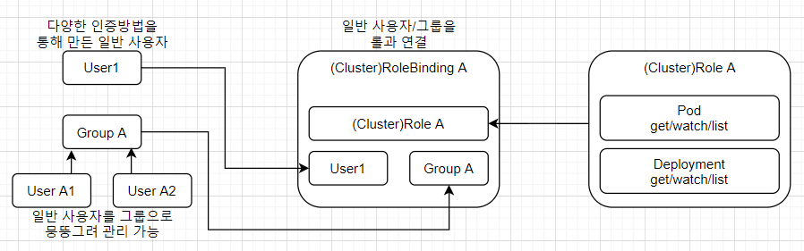
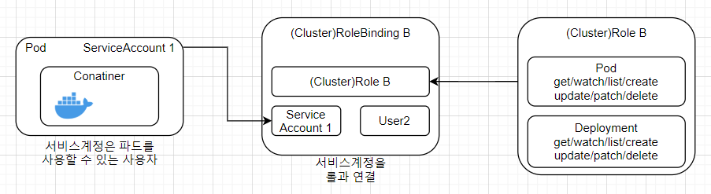

# CH07. 쿠버네티스 실전편

## 1. 쿠버네티스의 그 외 리소스

- INTRO
    - 쿠버네티스는 데몬으로 동작하는 서버 어플리케이션 외에도 배치 서버 등 다양한 형태의 어플리케이션을 구축할 수 있다.

- 잡(Job)
    - 정의 : 하나 이상의 파드를 생성해 지정된 수의 파드가 정상 종료될 때까지 이를 관리하는 리소스
    - 잡이 생성한 파드는 정상 종료된 후에도 삭제되지 않고 그대로 남아 있기 때문에 작어비 종료된 후에 파드의 로그나 실행 결과를 분석할 수 있다.
    - 데몬형 어플리케이션보다는 배치 작업 위주의 어플리케이션에 적합하다.
    - 잡은 파드 여러 개를 병렬로 실행하는 방법으로 쉽게 스케일아웃이 가능하다.
    - 파드 형태로 실행되므로 쿠버네티스 서비스와 연동하기도 쉽다.
    - simple-job.yaml
        ```yml
        apiVersion: batch/v1
        kind: Job
        metadata:
            name: pingpong
            labels:
                app: pingpong
        spec:
            parallelism: 3
            template:
                metadata:
                    labels:
                        app: pingpong
                spec:
                    containers:
                        -   name: pingpong
                            image: gihyodocker/apline:bash
                            command: ["/bin/sh"]
                            args:
                                -   "-c"
                                -   |
                                    echo [`date`] ping!
                                    sleep 10
                                    echo [`date`] pong!
                    restartPolicy: Never
        ```
        - 알파인 리눅스에 bash를 설치한 이미지를 컨테이너로 실행한다.
        - ping!을 출려하고 10초 뒤에 pong!을 출력한 뒤 종료된다.
        - spec.parallelism은 동시에 실행하는 파드의 수를 지정하는 속성이다.
            - 파드를 병렬로 실행해야할 때 편리하다.
        - restartPolicy는 파드 종료 후 재실행 여부를 설정하는 속성이다.
            - Never 혹은 OnFailure로 설정해야한다.
    - 적용 및 확인
        ```
        $ kubectl apply -f simple-job.yaml
        $ kubectl get pod -l app=pingpong --show-all
        ```
- 크론잡(cronjob)
    - 정의 : 스케줄을 지정해 정기적으로 파드를 실행할 수 있다.
    - 컨테이너 친화적인 특성을 유지하면서 스케줄에 따른 작업을 수행할 수 있다.
    - 일반적인 크론 작업은 서버의 CronTab으로 관리되지만, 크론잡 리소스는 매니페스트 파일로 정의된다.
    - 스케줄 정의 등을 깃허브의 풀 리퀘스트를 통해 검토할 수 있기 때문에 구성을 코드로 관리할 수 있다는 점에서도 유리하다.
    - simple-cronjob.yaml
        ```yml
        apiVersion: batch/v1
        kind: CronJob
        metadata:
            name: pingpong
        spec:
            schedule: "*/1 * * * *"
            jobTemplate:
                metadata:
                    labels:
                        app: pingpong
                spec:
                    containers:
                        -   name: pingpong
                            image: gihyodocker/apline:bash
                            command: ["/bin/sh"]
                            args:
                                -   "-c"
                                -   |
                                    echo [`date`] ping!
                                    sleep 10
                                    echo [`date`] pong!
                    restartPolicy: OnFailure
        ```
        - spec.schedule 속성에 Cron과 같은 포맷으로 파드를 실행할 스케줄을 정의한다.
        - spec.jobTemplate 아래에 잡 리소스와 마찬가지로 파드 정의가 들어간다.
    - 적용 및 확인
        ```
        $ kubectl apply -f simple-cronjob.yaml
        $ kubectl get job -l app=pingpong
        $ kubectl logs -l app=pingpong
        ```
    - 기존에는 작업을 정기적으로 실행하려면 작업을 실행하는 스크립트를 작성하고 리눅스 crontab으로 스케줄을 맞춰 이 스크립트를 실행하는 것이 대부분이었다.
    - 이 크론잡 리소스를 이용하면 이 모든 것을 컨테이너로 해결할 수 있다.
- 시크릿
    - 기밀정보를 평문으로 다루는 것은 어플리케이션 개발에서 금기이다.
    - 시크릿 리소스를 사용하면 이런 기밀정보 문자열을 Base64 인코딩으로 만들 수 있다.
    - 예시 : Nginx의 기본 인증정보가 적힌 파일을 시크릿으로 관리
        - openssl을 사용하여 사용자명과 패스워드를 암호화한 다음, 그 결과를 Base64 문자열로 변환한다.
            ```
            $ echo "your_username:$(openssl passwd -quiet -crypt your_password)" | base64
            ```
        - nginx-secret.yaml 파일에 시크릿 리소스의 매니페스트 파일을 작성한다.
            - 인증정보 파일인 .htpasswd 파일을 생성하고 이 파일에 base64로 면환된 문자열을 저장한다.
                ```yml
                apiVersion: v1
                kind: Secret
                metadata:
                name: nginx-secret
                type: Opaque
                data:
                    .htpasswd: [생성된 base64 문자열]
                ```
            - 적용
                ```
                $ kubectl apply -f nginx-secret.yaml
                ```
                - base64로 인코딩된 파일의 내용을 대시보드에서 확인할 수 있다.
            - 시크릿 리소스를 활용해 기본 인증이 적용된 Nginx를 구축한다. basic-auth.yaml
                ```yml
                apiVersion: v1
                kind: Service
                metadata:
                    name: basic-auth
                spec:
                    type: NodePort
                    selector:
                        app: basic-auth
                    prots:
                        -   protocol: TCP
                            port: 80
                            targetPort: http
                            nodePort: 30060
                ---
                apiVersion: apps/v1
                kind: Deployment
                metadata:
                    name: basic-auth
                    labels:
                        app: basic-auth
                spec:
                    replicas: 1
                    selector:
                        matchLabels:
                            app: basic-auth
                    template:
                        metadata:
                            labels:
                                app: basic-auth
                        spec:
                            containers:
                                -   name: nginx
                                    image: "gihyodocker/nginx:latest"
                                    imagePullPolicy: Always
                                    ports:
                                        -   name: http
                                            containerPort: 80
                                    env:
                                        -   name: BACKEND_HOST
                                            value: "localhost:8080"
                                        -   name: BASIC_AUTH_FILE
                                            value: "/etc/nginx/secret/.htpasswd"
                                    volumeMounts:
                                        -   mountPath: /etc/nginx/secret
                                            name: nginx-secret
                                            readOnly: true
                                -   name: echo
                                    image: "gihyodocker/echo:latest"
                                    imagePUllPolicy: Always
                                    ports:
                                        -   containerPort: 8080
                                    env:
                                        -   name: HTTP_PORT
                                            value: "8080"
                            volumes:
                                -   name: nginx-secret
                                    secret:
                                        secretName: nginx-secret
                ```
                - 앞에서 생성한 nginx-secret 스크릿을 볼륨으로 마운트할 준비를 한다.
                - nginx 컨테이너 안의 /etc/nginx/secret 디렉터리에 마운트한다.
                - nginx-secret에 .htpasswd로 설정된 Base64 문자열이 디코딩되어 nginx 컨테이너의 /etc/nginx/secret/.htaccess 파일이 된다.
                - gihyodocker/nginx:latest 이미지에 환경 변수 BASIC_AUTH_FILE에 인증정보 파일의 경로를 설정해 기본 인증을 적용한다.
            - 적용
                ```
                $ kubectl apply -f basic-auth.yaml
                ```
            - 확인
                ```
                $ curl http://localhost:30060
                $ curl -i --user your_username:your_password http://localhost:30060
                ```
    - 시크릿 리소스를 사용하면 민감한 정보를 평문으로 방치하지 않을 수 있다.
    - 시크릿 리소스는 여러 층위에 걸치 보안 대책 중 하나라고 생각해야한다.
    - 리포지토리는 물론이고 쿠버네티스 대시보드 및 파드에도 제삼자가 접근하지 못하도록 하는 것이 중요하다.
- 인증정보를 환경변수로 안전하게 관리하기
    ```
    $ echo -n "gihyo:gihyo@tcp(mysql-master:3306)/tododb?parseTime=true" | base64
    $ echo -n "gihyo:gihyo@tcp(mysql-slave:3306)/tododb?parseTime=true" | base64
    ```
    - secret
        ```yml
        apiVersion: v1
        kind: Secret
        metadata:
        name: mysql-secret
        type: Opaque
        data:
            username: [master의 인코딩 결과]
            password: [slave의 인코딩 결과]
        ```
    - api 디플로이먼트 수정 : 환경변수의 value 대신에 valueFrom.SecretKeyRef를 사용한다.
        ```yml
        apiVersion: v1
        kind: Service
        metadata:
            name: todoapi
            labels:
                app: todoapi
        spec:
            selector:
                app: todoapi
            ports:
                -   name: http
                    port: 80
        ---
        apiVersion: apps/v1
        kind: Deployment
        metadata:
            name: todoapi
            labels:
                name: todoapi
        spec:
            replicas: 2
            selector:
                matchLabels:
                    app: todoapi
            template:
                metadata:
                    labels:
                        app: todoapi
                spec:
                    containers:
                        -   name: nginx
                            image: gihyodocker/nginx:latest
                            imagePullPolicy: Always
                            ports:
                                -   containerPort: 80
                            env:
                                -   name: WORKER_PROCESSES
                                    value: "2"
                                -   name: WORKER_CONNECTIONS
                                    value: "1024"
                                -   name: LOG_STDOUT
                                    value: "true"
                                -   name: BACKEND_HOST
                                    value: "localhost:8080"
                        -   name: api
                            image: gihyodocker/todoapi:latest
                            imagePullPolicy: Always
                            ports:
                                -   containerPort: 8080
                            env:
                                -   name: TODO_BIND
                                    value: ":8080"
                                -   name: TODO_MASTER_URL   # (1) 수정
                                    valueFrom:
                                        secretKeyRef:
                                            name: mysql-secret
                                            key: username
                                -   name: TODO_SLAVE_URL    # (2) 수정
                                        secretKeyRef:
                                            name: mysql-secret
                                            key: password
        ```
    - 확인
        ```
        $ kubectl describe pod todoapi-[무작위로 생성]
        ```

## 2. 사용자 관리와 RBAC

- INTRO
    - 기본적인 보안 방법 : 사용자마다 권한을 제한하는 정책

    |명칭|내용|
    |:---|:---|
    |일반 사용자|클러스터 외부에서 쿠버네티스를 조작하는 사용자로, 다양한 방법으로 인증을 거친다.|
    |서비스 계정|쿠버네티스 내부적으로 관리되며 파드가 쿠버네티스 API를 다룰 때 사용하는 사용자.|

    - 일반 사용자
        - 개발자 및 운영 실무자가 쿠버네티스를 조작하기 위해 사용한다.
        - 쿠버네티스 클러스 외부로부터 들어오는 접근을 관리하기 위한 사용자.
    - 서비스 계정
        - 쿠버네티스 리소스의 일종
        - 클러스터 내부에서 권한을 관리하는 역할을 한다.
        - 서비스 계정과 연결된 파드는 주어진 권한에 따라 쿠버네티스 리소스를 다룰 수 있다.
- RBAC(Role-Based Access Control)
    - 서비스 계정과 일반 사용자의 권한을 제어하는 메커니즘
    - RBAC는 롤에 따라 리소스에 대한 권한을 제어하는 기능이라 개념이다.

    

    

    |리소스|내용|
    |:---|:---|
    |롤|각 쿠버네티스 API의 사용 권한을 정의한다. 지정된 네임스페이스 안에서만 유효함.|
    |롤바인딩|일반 사용자 및 그룹/서비스 계정과 롤을 연결한다.|
    |클러스터롤|각 쿠버네티스 API의 사용 권한을 정의한다. 클러스터 전체에서 유효함.|
    |클러스터롤바인딩|일반 사용자 및 그룹/서비스 계정과 클러스터롤을 연결.|
- 롤과 바인딩 리소스 생성하기
    - ClusterRole 생성
        ```
        $ cat <<EOF | kubectl apply -f -
        kind: ClusterRole
        apiVersion: rbac.authorization.k8s.io/v1
        metadata:
        name: pod-reader
        rules:
        - apiGroups: [""]
        resources: ["pods"]
        verbs: ["get", "watch", "list"]
        EOF
        ```
    - ClusterRoleBinding 생성
        ```
        $ cat <<EOF | kubectl apply -f -
        kind: ClusterRoleBinding
        apiVersion: rbac.authorization.k8s.io/v1
        metadata:
        name: pod-read-binding
        subjects:
        - kind: ServiceAccount
        name: gihyo-user
        namespace: default
        roleRef:
        kind: ClusterRole
        name: pod-reader
        apiGroup: rbac.authorization.k8s.io
        EOF
        ```
        - subject 속성 아래 롤이 연결된 일반 사용자 또는 일반 사용자 그룹을 지정한다.
- 일반 사용자 및 일반 사용자 그룹 생성
    - 일반 사용자의 인증 방법
        - 서비스 계정 토큰 방식
        - 정적 토큰 파일 방식
        - 패스워드 파일 방식
        - X509 클라이언트 인증서 방식
        - OpenID 방식
    - 서비스 계정 토큰 방식을 사용하여 인증을 진행하겠다.
    - 계정 생성
        ```
        $ kubectl create serviceaccount gihyo-user
        ```
    - 새롭게 생성한 계정의 권한 확인
        ```
        $ kubectl get serviceaccount gihyo-user -o yaml
        ```
    - 서비스 계정을 생성하면 그 인증정보가 되는 시크릿 리소스가 함께 생성된다.
        - secret 아래의 gihyo0user-token-dwwmp 부분이 이에 해당한다.
        ```
        $ kubectl get secret gihyo-user-token-dwwmp -o yaml
        ```
        - 출력되는 부분에서 인증 토큰 부분(data.token)을 복사한다.
        - 이 토큰은 Base64 인코딩 문자열로, 이를 디코딩한 문자열이 실제 인증 토큰이 된다.(토큰을 잘 보관해 둔다.)
            ```
            $ echo '[보관한 토큰]' | base64 -D
            [결과를 보관한다.]
            ```
- 생성한 일반 사용자 사용하기
    - kubectl은 HTTP/HTTPS로 쿠버네티스 API를 호출하여 쿠버네티스 클러스터의 마스터 노드에 접근한다.
    - 이때 필요한 인증정보는 마스터 노드의 ~/.kube/config라는 yaml 파일에 설정되어 있다.
        ```
        $ kubectl config view
        ```

## 3. 헬름

## 4. 쿠버네티스 배포 전략