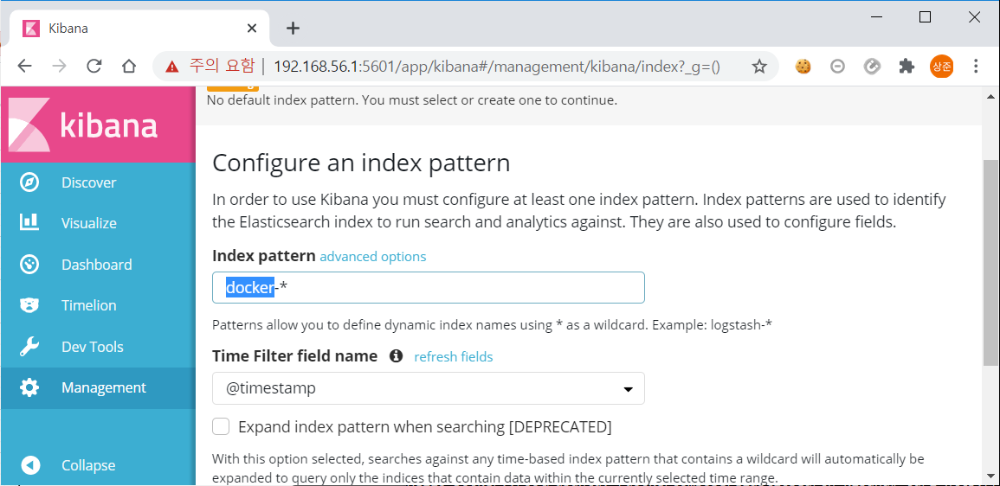

# CH08. 컨테이너 운영

## 1. 로깅 운영

- INTRO
    - 컨테이너 환경의 효율적인 로그 관리 등 관리 운영적 부분에 중접을 두고 운영 환경에서 알아둬야 할 주의 사항을 설명한다.
- 컨테이너에서 생성되는 로그
    - 비컨테이너 환경
        - 서버 업타임이 길기 때문에 로그가 누적되어 상당한 디스크 용량을 차지하는 일이 자주 발생한다.
    - 도커
        - 로그 라이브러리를 사용해도 로그가 파일이 아니라 표준 출력으로 출력하고 이를 다시 Fluentd 같은 로그 컬렉터로 수집하는 경우가 많다.
        - 어플리케이션 쪽에서 로그 로테이션을 할 필요가 없으며 로그 전송을 돕는 로깅 드라이버 기능도 갖추고 있으므로 로그 수집이 편리하다.
    - 표준 출력과 로그
        - gihyodocker/echo:latest 사용
        - 포어그라운드로 실행한 다음 http://localhost:8080으로 요청을 보내면 표준 출력으로 출력된다.
            ```
            $ docker container run -it --rm -p 8080:8080 gihyodocker/echo:latest
            2020/06/26 02:19:53 start server
            2020/06/26 02:20:18 received request
            ```
        - 호스트에 컨테이너 데이터가 저장되는 디렉터리 : /var/lib/docker/containers/컨테이너ID
        - 컨테이너 데이터가 저장되는 디렉터리에 컨테이너ID-json.log 파일이 로그 파일이다.
            ```
            # 컨테이너ID : 9b0eb43784afcc61efb36de58c4115931a0fa51fb87629ee6cff8624e0dd999a
            $ tail /var/lib/docker/containers/[컨테이너ID]/[컨테이너ID]-json.log
            ```
            또는
            ```
            # 로그파일 있는 곳을 볼륨으로 컨테이너 생성
            $ docker container run -it --rm -v /var/lib/docker/containers:/json-log alpine ash
            / # cd json-log/[컨테이너ID]
            json-log/[컨테이너ID]/ # ls
            json-log/[컨테이너ID]/ # tail [컨테이너ID]-json.log
            ```
        - 컨테이너 표준 출력으로 출력된 내용이 JSON 포맷으로 출력된 것을 확인할 수 있다.
        - 어플리케이션에서 로그를 파일에 출력하도록 구현하지 않았더라도 도커에서 컨테이너의 표준 출력을 로그로 출력해 주는 것이다.
        - **로그 출력 자체를 완전히 도커에 맡길 수 있다.**
- 로깅 드라이버
    - 로그가 JSON 포맷으로 출력되는 이유는 도커에 json-file이라는 기본 로깅 드라이버가 있기 때문이다.
    - 로깅 드라이버 : 도커 컨테이너가 출력하는 로그를 어떻게 다룰지를 제어하는 역할을 한다.

    |종류|설명|
    |:---|:---|
    |Syslog|syslog로 로그를 관리|
    |Journald|systemd로 로그를 관리|
    |Awslogs|AWS CloudWatch Logs로 로그를 전송|
    |Gcplogs|Google Cloud Logging으로 로그를 전송|
    |Fluentd|fluentd로 로그를 관리|
- 컨테이너 로그 다루기
    - 장애로 인해 예기치 않게 컨테이너가 정지되고 디스크에서 완전히 삭제되었다면 컨테이너 안에 로그를 파일로 남기면 컨테이너를 삭제할 때 로그도 함께 잃어버린다는 큰 문제가 발생한다.
    - 방법
        - 호스트에서 컨테이너에 공유한 볼륨에 파일로 로그를 남기는 방법
        - 로그를 표준 출력으로 남기고 이 내용을 호스트에서 파일에 수집하는 방법
        - 도커에서는 후자를 정석으로 여긴다.
    - 컨테이너 로그의 로테이션
        - 도커 컨테이너 로깅 동작 제어 옵션 : --log-opt
            - --log-opt max-size=1m : 로테이션이 발생하는 로그 파일 최대 크기
            - --log-opt max-file=5 : 최대 파일 개수. 이 값을 초과할 경우 오래된 파일부터 삭제된다.
            ```
            $ docker container run -it --rm -p 8080:8080 --log-opt max-size=1m --log-opt max-file=5 gihyodocker/echo:latest
            ```
            - max-size로 설정한 파일 크기에 도달하면 파일이 로테이션된다.
                ```
                ----.log        # 최신
                ----.log.1      # 이전 로그
                ```
            - 이 설정은 컨테이너마다 일일이 할 필요는 없고, 도커 데몬에서 log-opts 기본값으로 설정할 수 있다.
                - /etc/docker/daemon.json
                    ```json
                    {
                        "log-driver" : "json-file",
                        "log-opts" : {
                            "max-size" : "10m",
                            "max-file" : "5"
                        }
                    }
                    ```
- Fluentd와 Elasticsearch를 이용한 로그 수집 및 검색 기능 구축
    - 파일 기반의 로그 관리 방식은 번거롭다.
    - 컨테이너가 출력하는 JSON 로그 파일을 다른 곳으로 전송해 모아놓고 관리 및 열람하는 기능이 필요하다.
    - 로그  수집 : 로그 컬렉터 Fluentd
    - 로그를 저장하는 데이터 스토어 : Elasticsearch

        

    - elasticsearch와 kibana 구축
        - docker-compose.yaml
            ```yml
            version: "3"
            services:
                elasticsearch:
                    image: elasticsearch:5.6-alpine
                    ports:
                        -   "9200:9200"
                    volumes:
                        -   "./jvm.options:/usr/share/elasticsearch/config/jvm.options"
                kibana:
                    image: kibana:5.6
                    ports:
                        -   "5601:5601"
                    environment:
                        ELASTICSEARCH_URL: "http://elasticsearch:9200"
                    depends_on:
                        -   elasticsearch
            ```
        - jvm.options
            ```
            -Xms128m
            -Xmx256m
            -XX:+UseConcMarkSweepGC
            -XX:CMSInitiatingOccupancyFraction=75
            -XX:+UseCMSInitiatingOccupancyOnly
            -XX:+AlwaysPreTouch
            -server
            -Xss1m
            -Djava.awt.headless=true
            -Dfile.encoding=UTF-8
            -Djna.nosys=true
            -Djdk.io.permissionsUseCanonicalPath=true
            -Dio.netty.noUnsafe=true
            -Dio.netty.noKeySetOptimization=true
            -Dio.netty.recycler.maxCapacityPerThread=0
            -Dlog4j.shutdownHookEnabled=false
            -Dlog4j2.disable.jmx=true
            -Dlog4j.skipJansi=true
            -XX:+HeapDumpOnOutOfMemoryError
            ```
        - docker-compose 실행 및 확인
            ```
            $ docker-compose up -d
            $ docker container ls
            ```
    - fluentd 구축
        - Dockerfile
            ```Dockerfile
            FROM fluent/fluentd:v0.12-debian

            RUN gem install fluent-plugin-elasticsearch --no-rdoc --no-ri --version 1.9.2
            COPY fluent.conf /fluentd/etc/fluent.conf
            ```
        - fluent.conf
            ```conf
            <source>
                @type forward
                port 24224
                bind 0.0.0.0
            </source>

            <match *.**>
                @type copy
                <store>
                    type elasticsearch
                    host elasticsearch
                    port 9200
                    logstash_format true
                    logstash_prefix docker
                    logstash_dataformat %Y%m%d
                    include_tag_key true
                    type_name app
                    tag_key @log_name
                    flush_interval 5s
                </store>
                <store>
                    type file
                    path /fluentd/log/docker_app
                </store>
            </match>
            ```
        - image 생성
            ```
            $ docker image build -t ch08/fluentd-elasticsearch:latest .
            ```
    - fluentd 로딩 드라이버로 컨테이너 로그 전송
        - docker-compose.yaml 수정
            ```yml
            services:
                elasticsearch:
                    image: elasticsearch:5.6-alpine
                    ports:
                        -   "9200:9200"
                    volumes:
                        -   "./jvm.options:/usr/share/elasticsearch/config/jvm.options"
                kibana:
                    image: kibana:5.6
                    ports:
                        -   "5601:5601"
                    environment:
                            ELASTICSEARCH_URL: "http://elasticsearch:9200"
                    depends_on:
                        -   asticsearch
                fluentd:
                    image: ch08/fluentd-elasticsearch:latest
                    ports:
                        - "24224:24224"
                        - "24220:24220"
                    depends_on:
                        -   elasticsearch
                echo:
                    image: gihyodocker/echo:latest
                    ports:
                        -   "8080:8080"
                    logging:
                        driver: "fluentd"
                        options:
                            fluentd-address: "localhost:24224"
                            tag: "docker.{{ .Name }}"
                    depends_on:
                        -   fluentd
            ```
        - 로그 생성(여러번 실행한다.)
            ```
            $ curl http://localhost:8080
            ```
    - 로그 확인하기
        - fluent.conf의 flush_interval 값이 로그를 Elasticsearch로 보내는 시간 간격이다.
        - elasticsearch가 만든 인덱스는 다음과 같이 확인할 수 있다.
            ```
            $ curl http://localhost:9200/_cat/indices?v
            ```
        - docker-yyyymmdd 형식으로 인덱스가 생성되었음을 확인할 수 있다.
        - 이름은 fluent.conf 파일에서 logstash_prefix, logstash_dateformat 값으로 설정된 것이다.
        - kibana 접속 : http://localhost:5601/app/kibana

            

            
- flentd 로깅 드라이버의 운영 구조
    - 일반적인 구조
        
        
    - 각 호스트에 fluentd를 배치하고 항상 가동 상태 유지
        - fluentd가 한 호스트에만 배치되었을 때 로그가 한 곳에 수집되는 형태는 잉여성을 확보할 필요가 있고, 호스트 수나 발생하는 로그 양에 걸맞은 fluentd를 갖추기도 번거롭다.
        - fluentd를 모든 호스트에 배치하였을 때는 장애가 발생해도 해당 호스트의 로그 수집에만 영향을 국한할 수 있다.
        - 이 방법은 fluentd를 모든 호스트에 배치하는 것이 중요하다.
        - 가상 머신 이미지에 fluentd를 포함시키거나 어플리케이션 컨테이너를 배포하기 전에 프로비저닝을 통해 fluentd를 배치하는 것이 효과적이다.
    - fluentd 모니터링 사항
        - buffer_queue_length : 버퍼에 저장된 청크의 수
        - buffer_total_queued_size : 버퍼에 저장된 청크의 크기 합
        - retry_count : 재시도 횟수
    - fluent.conf 파일에 monitor_agent를 설정해 이 항목의 상태를 확인할 수 있다.
        ```conf
        <source>
            @type monitor_agent
            bind 0.0.0.0
            port 24220
        </source>
        ```
    - monitor_agent를 지원하는 Sensu 플러그인도 제공되므로 다양한 통합 감시 소프트웨어로 fluentd를 모니터링할 수 있다.
- 가용성과 신뢰성을 갖춘 로그 스토리지 선택
    - elasticsearch같은 데이터스토어를 안정적으로 운영한다는 것은 쉬운 일이 아니다.
    - Elastic Cloud, AWS Elasticsearch Service 와 같은 매니지드 서비스를 이용하는 것도 고려할만 하다.
    - Amazon S3, Google Cloud Storage 같은 오브젝트 스토리지도 좋은 솔루션이다.
    - elasticsearch, 오브젝트 스토리지 양쪽으로 로그를 전송하되 최근 로그는 일정기간 Elasticsearch에서 다루게 한다면 비용을 절감할 수 있다.
- 쿠버네티스에서 로그 관리하기
    - 로컬 쿠버네티스를 사용하여 구축한다.
    - 쿠버네티스의 로그 관리 역시 도커(도커 컴포즈)와 크게 다르지 않다.
    - 쿠버네티스는 다수의 도커 호스트를 노드로 운영하는데, 어떤 노드에 어떤 파드가 배치될지는 쿠버네티스 스케줄러가 결정한다.
    - 각 컨테이너가 독자적으로 로그를 관리하면 비용(리소스)이 많이 든다.
    - 쿠버네티스 환경에 Elasticsearch와 kibana를 구축한 뒤 fluentd와 DaemonSet을 구축한다.
        - 쿠버네티스에 Elasticsearch와 kibana 구축
            - 로그는 네임스페이스를 뛰어넘어 Elasticsearch에 모여야 로그 검색에 편리하므로 kube-system 네임스페이스에 배치한다.
            - elasticsearch.yaml
                ```yml
                kind: PersistentVolumeClaim
                apiVersion: v1
                metadata:
                    name: elasticsearch-pvc
                    namespace: kube-system
                    labels:
                        kubernetes.io/cluster-service: "true"
                spec:
                    accessModes:
                        -   ReadWriteOnce
                    resources:
                        requests:
                            storage: 2Gi
                ---
                apiVersion: v1
                kind: Service
                metadata:
                    name: elasticsearch
                    namespace: kube-system
                spec:
                    selector:
                        app: elasticsearch
                    ports:
                        -   protocol: TCP
                            port: 9200
                            targetPort: http
                ---
                apiVersion: apps/v1
                kind: Deployment
                metadata:
                    name: elasticsearch
                    namespace: kube-system
                    labels:
                        app: elasticsearch
                spec:
                    replicas: 1
                    selector:
                        matchLabels:
                            app: elasticsearch
                    template:
                        metadata:
                            labels:
                                app: elasticsearch
                        spec:
                            containers:
                                -   name: elasticsearch
                                    image: elasticsearch:5.6-alpine
                                    ports:
                                        -   containerPort: 9200
                                            name: http
                                    volumeMounts:
                                        -   mountPath: /data
                                            name: elasticsearch-pvc
                                        -   mountPath: /usr/share/elasticsearch/config/elasticsearch.yml
                                            name: elasticsearch-config-elasticsearch-yml
                                            subPath: elasticsearch.yml
                                        -   mountPath: /usr/share/elasticsearch/config/log4j2.properties
                                            name: elasticsearch-config-log4j2-properties
                                            subPath: log4j2.properties
                                        -   mountPath: /usr/share/elasticsearch/config/jvm.options
                                            name: elasticsearch-config-jvm-options
                                            subPath: jvm.options
                            volumes:
                                -   name: elasticsearch-pvc
                                    persistentVolumeClaim:
                                        claimName: elasticsearch-pvc
                                -   name: elasticsearch-config-elasticsearch-yml
                                    configMap:
                                        name: elasticsearch-config-elasticsearch-yml
                                        defaultMode: 0777
                                -   name: elasticsearch-config-log4j2-properties
                                    configMap:
                                        name: elasticsearch-config-log4j2-properties
                                        defaultMode: 0777
                                -   name: elasticsearch-config-jvm-options
                                    configMap:
                                        name: elasticsearch-config-jvm-options
                                        defaultMode: 0777
                ---
                kind: ConfigMap
                apiVersion: v1
                metadata:
                    name: elasticsearch-config-elasticsearch-yml
                    namespace: kube-system
                data:
                    elasticsearch.yml: |-
                        http.host: 0.0.0.0
                ---
                kind: ConfigMap
                apiVersion: v1
                metadata:
                    name: elasticsearch-config-log4j2-properties
                    namespace: kube-system
                data:
                    log4j2.properties: |-
                        status = error

                        appender.console.type = Console
                        appender.console.name = console
                        appender.console.layout.type = PatternLayout
                        appender.console.layout.pattern = [%d{ISO8601}][%-5p][%-25c{1.}] %marker%m%n

                        rootLogger.level = info
                        rootLogger.appenderRef.console.ref = console
                ---
                kind: ConfigMap
                apiVersion: v1
                metadata:
                    name: elasticsearch-config-jvm-options
                    namespace: kube-system
                data:
                    jvm.options: |-
                        -Xms128m
                        -Xmx256m
                        -XX:+UseConcMarkSweepGC
                        -XX:CMSInitiatingOccupancyFraction=75
                        -XX:+UseCMSInitiatingOccupancyOnly
                        -XX:+AlwaysPreTouch
                        -server
                        -Xss1m
                        -Djava.awt.headless=true
                        -Dfile.encoding=UTF-8
                        -Djna.nosys=true
                        -Djdk.io.permissionsUseCanonicalPath=true
                        -Dio.netty.noUnsafe=true
                        -Dio.netty.noKeySetOptimization=true
                        -Dio.netty.recycler.maxCapacityPerThread=0
                        -Dlog4j.shutdownHookEnabled=false
                        -Dlog4j2.disable.jmx=true
                        -Dlog4j.skipJansi=true
                        -XX:+HeapDumpOnOutOfMemoryError
                ```
                - 쿠버네티스 컨피그맵을 사용해 컨테이너 안의 파일을 덮어쓸 수 있다.
                - 매니페스트 파일을 쿠버네티스에 적용한다.
            - kibana 역시 kube-system 네임스페이스에 배치한다.
            - kibana.yaml
                ```yml
                apiVersion: v1
                kind: Service
                metadata:
                    name: kibana
                    namespace: kube-system
                spec:
                    selector:
                        app: kibana
                    ports:
                        -   protocol: TCP
                            port: 5601
                            targetPort: http
                            nodePort: 30050
                    type: NodePort
                ---
                apiVersion: apps/v1
                kind: Deployment
                metadata:
                    name: kibana
                    namespace: kube-system
                    labels:
                        app: kibana
                spec:
                    replicas: 1
                    selector:
                        matchLabels:
                            app: kibana
                    template:
                        metadata:
                            labels:
                                app: kibana
                        spec:
                            containers:
                                -   name: kibana
                                    image: kibana:5.6
                                    ports:
                                        -   containerPort: 5601
                                            name: http
                                    env:
                                        -   name: ELASTICSEARCH_URL
                                            value: "http://elasticsearch:9200"
                ```
                - elasticsearch의 ClusterIP를 env.URL의 value로 넣어준다.
                - 매니페스트 파일을 쿠버네티스에 적용한다.
        - DaemonSet으로 fluentd 구축
            - DaemonSet : 파드를 관리하는 리소스로, 모든 노드에 하나씩 배치된다.
            - fluentd-daemonset.yaml
                ```yml
                apiVersion: apps/v1
                kind: DaemonSet
                metadata:
                    name: fluentd
                    namespace: kube-system
                    labels:
                        app: fluentd-logging
                        version: v1
                        kubernetes.io/cluster-service: "true"
                spec:
                    selector:
                        matchLabels:
                            app: fluentd-logging
                    template:
                        metadata:
                            labels:
                                app: fluentd-logging
                                version: v1
                                kubernetes.io/cluster-service: "true"
                        spec:
                            tolerations:
                                -   key: node-role.kubernetes.io/master
                                    effect: NoSchedule
                            containers:
                                -   name: fluentd
                                    image: fluent/fluentd-kubernetes-daemonset:elasticsearch
                                    env:
                                        -   name: FLUENT_ELASTICSEARCH_HOST
                                            value: "elasticsearch"
                                        -   name: FLUENT_ELASTICSEARCH_PORT
                                            value: "9200"
                                        -   name: FLUENT_ELASTICSEARCH_SCHEME
                                            value: "http"
                                    resources:
                                        limits:
                                            memory: 200Mi
                                        requests:
                                            cpu: 100m
                                            memory: 200Mi
                                    volumeMounts:
                                        -   name: varlog
                                            mountPath: /var/log
                                        -   name: varlibdockercontainers
                                            mountPath: /var/lib/docker/containers
                                            readOnly: true
                            terminationGracePeriodSeconds: 30
                            volumes:
                                -   name: varlog
                                    hostPath:
                                        path: /var/log
                                -   name: varlibdockercontainers
                                    hostPath:
                                        path: /var/lib/docker/containers
                ```
                - elasticsearch의 ClusterIP를 env.HOST의 value로 넣어준다.
                - 매니페스트 파일을 쿠버네티스에 적용한다.
        - 어플리케이션 파드 실행
            - 환경변수 LOG_STDOUT의 값에 따라 JSON 포맷으로 된 접근 로그를 표준 출력으로 출력한다.
            - echo.yaml
                ```yml
                apiVersion: v1
                kind: Service
                metadata:
                    name: echo
                spec:
                    selector:
                        app: echo
                    ports:
                        -   protocol: TCP
                            port: 80
                            targetPort: http
                            nodePort: 30080
                    type: NodePort                
                ---
                apiVersion: apps/v1
                kind: Deployment
                metadata:
                    name: echo
                    labels:
                        app: echo
                spec:
                    replicas: 1
                    selector:
                        matchLabels:
                            app: echo
                    template:
                        metadata:
                            labels:
                                app: echo
                        spec:
                            containers:
                                -   name: nginx
                                    image: gihyodocker/nginx:latest
                                    env:
                                        -   name: BACKEND_HOST
                                            value: localhost:8080
                                        -   name: LOG_STDOUT
                                            value: "true"
                                    ports:
                                        -   name: http
                                            containerPort: 80
                                -   name: echo
                                    image: gihyodocker/echo:latest
                                    ports:
                                        -   containerPort: 8080
                ```
        - 키바나와 echo어플리케이션 인그레스
            - echo-ingress.yaml
                ```yml
                apiVersion: extensions/v1beta1
                kind: Ingress
                metadata:
                    name: echo
                    labels:
                        app: echo
                spec:
                    rules:
                        -   host: echoservice
                            http:
                                paths:
                                    -   backend:
                                            serviceName: echo
                                            servicePort: 80
                ```
            - kibana-ingress.yaml
                ```yml
                metadata:
                    name: kibana
                    namespace: kube-system
                    labels:
                        app: kibana
                spec:
                    rules:
                        -   http:
                                paths:
                                    -   backend:
                                            serviceName: kibana
                                            servicePort: 5601
                ```
        - echo 컨테이너에서 어플리케이션이 출력한 로그는 log 필드에 등록되며 그 외 레이블, 파드명, 컨테이너명 등을 볼 수 있다.
        - nginx 컨테이너의 로그는 쿠버네티스와 관련된 필드 뿐만 아니라 nginx 접근 로그의 항목도 별도의 필드로 포함되어 있다.
        - fluent/fluentd-kubernetes-daemonset을 사용하면 컨테이너에서 출력된 표준 출력 로그가 JSON 포맷일 경우 이를 파싱해 모든 속성을 인덱싱에 포함해준다.
        - 어플리케이션 및 미들웨어 컨테이너의 로그를 전부 JSON 포맷으로 변환하 별도로 인덱싱하고 싶은 항목을 속성으로 분리해두는 것이 중요하다.
    - 도커/쿠버네티스 로그 관리 원칙
        1. 어플리케이션 로그는 모두 표준 출력으로 출력한다. 컨테이너로 운영하는 것을 전제로 한다면 파일 출력 자체가 불필요하다.
        2. nginx 등의 미들웨어는 로그가 표준 출력으로 출력되도록 이미지를 빌드한다.
        3. 표준 출력으로 출력되는 로그는 모두 JSON 포맷으로 출력해 각 속성을 검색할 수 있게 한다.
        4. 쿠버네티스 환경에서는 fluent/fluentd-kubernetes-daemonset을 포함한 파드를 DaemonSet을 사용해 각 호스트에 배치한다.
        5. 쿠버네티스 리소스에는 적절히 레이블을 부여해 로그를 검색할 수 있게 한다.
- 그 외의 로그 수집 도구
    - 구글 스택드라이버
        - 스택드라이버 : GCP나 AWS에서 로깅 및 모니터링에 사용되는 매니지드 서비스
    - stern
        - 보다 가벼운 로그 열람 도구
        - 레이블을 지정하면 실행 중인 파드에 속한 컨테이너의 로그를 볼 수 있다.
        - 예시
            ```
            $ stern -l app=echo
            $ stern -l app=todoweb --context [컨텍스트 지정]
            ```
## 2. 도커 호스트 및 데몬 운영

- 컨테이너의 라이브 리스토어
- dockerd 튜닝하기
- 도커 운영 시의 장애 대책

## 3. 장애 대책

- 쿠버네티스 운영 시의 장애 대책
- 헬름의 릴리즈 히스토리 제한